# 用 Kubernetes 标准组件扩展 AI 训练任务

这个项目演示生产中更常见的 AI Infra 分层：业务方声明 `AIJob`，一个很薄的 Controller 将它翻译为 `JobSet`；JobSet 管理分布式任务生命周期，Kueue 负责整组准入、配额和跨节点拓扑，kube-scheduler 与设备驱动完成节点和 GPU 分配。

项目仍保留一个 Scheduler Framework 插件，用来展示标准调度器无法表达的集群级节点偏好。它不是 Job Controller，也不能替代设备驱动。

## 一、业务方如何使用

平台组件安装完成后，训练业务只提交声明式 YAML：

```yaml
apiVersion: infra.example.io/v1alpha1
kind: AIJob
metadata:
  name: demo-training
  labels:
    kueue.x-k8s.io/queue-name: training
spec:
  workers: 4
  gpuPerWorker: 2
  gpuResource: nvidia.com/gpu
  topology: nvlink
  image: registry.example.com/training:v1
  args: ["--mode=complete", "--duration=30s"]
```

字段表达业务意图：

- `workers`：分布式训练的 Worker 数量；
- `gpuPerWorker`：每个 Worker 请求的 GPU 数量；
- `gpuResource`：Device Plugin 或 DRA 暴露的资源名；
- `topology`：实验中的 `nvlink`、`pcie` 或 `same-rack`；
- `image`：训练镜像；
- `args`：按声明顺序原样传给 Worker 容器；省略时保持长驻等待的兼容行为；
- `kueue.x-k8s.io/queue-name`：任务进入的 LocalQueue。

业务方不创建 Pod，不指定某个 Node，也不负责在代码中调用 Controller 或 Scheduler。各组件通过 Kubernetes API 中的资源协作。

## 二、生产架构的职责边界

先看 Kubernetes 自身的控制面。几乎所有组件都通过 API Server 协作，而不是彼此直接调用：

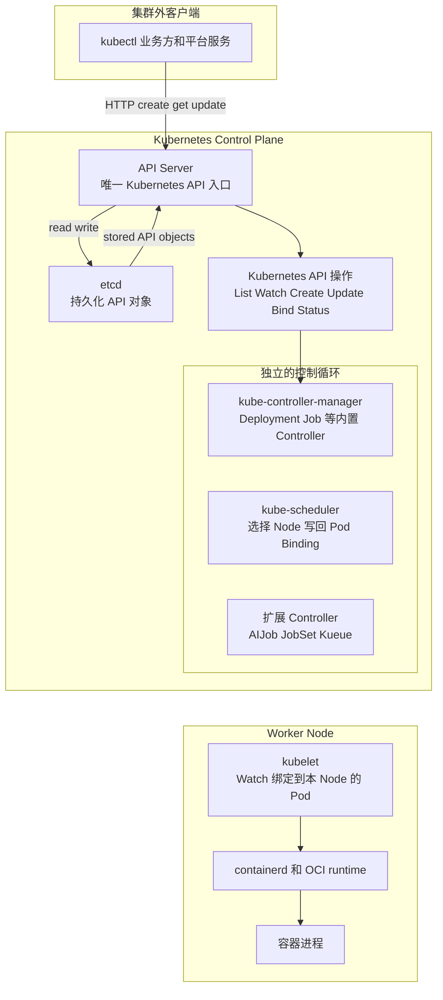

三个控制循环之间没有箭头；它们都通过图中的 API 通道独立 List/Watch 和写回。下一张时序图会展示真实交互。`etcd` 只由 API Server 直接访问，Controller、Scheduler 和 kubelet都不直接读写 etcd。

### 先理解 API 对象：metadata、spec 和 status

Kubernetes 组件协作的媒介不是函数调用，而是 API 对象。一个典型对象可以简化为：

```yaml
apiVersion: v1
kind: Pod
metadata:
  name: worker-0
  resourceVersion: "1382"
spec:
  containers:
    - name: worker
      image: training:v1
  nodeName: ""
status:
  phase: Pending
```

- `metadata`：对象身份和版本，包括名称、namespace、labels、ownerReferences 和 `resourceVersion`；
- `spec`：用户或 Controller 声明的期望，例如镜像、资源请求和副本数；
- `status`：负责运行该对象的组件观察到的结果，例如 Pod phase、条件和容器状态；
- `resourceVersion`：API Server 为对象版本维护的标识，Watch 和并发更新用它判断“从哪个版本继续”以及“对象是否已被别人修改”。

不是所有对象都有完全相同的 spec/status 规则，但这个模型足以理解 Controller：它读取对象，比较期望与观察结果，然后创建、更新或删除其他 API 对象，并在需要时更新 status。

### List、Watch 和 Informer 到底是什么

假设 Controller 需要关注所有 Job。最直接但错误的写法是每秒查询一次：

```text
GET /apis/batch/v1/jobs
等待一秒
再次 GET 全部 Job
```

这会重复传输大量未变化的数据。Kubernetes 客户端通常组合两种 API：

- **List**：启动时获取当前已有的全部目标对象，相当于拿一次完整快照；
- **Watch**：从某个 `resourceVersion` 开始保持长连接，只接收之后的 Added、Modified、Deleted 事件。

但是 Watch 连接会断开，事件可能重复，Controller 也可能重启。`Informer` 就是 client-go 提供的通用封装，用来可靠地管理这套观察过程：

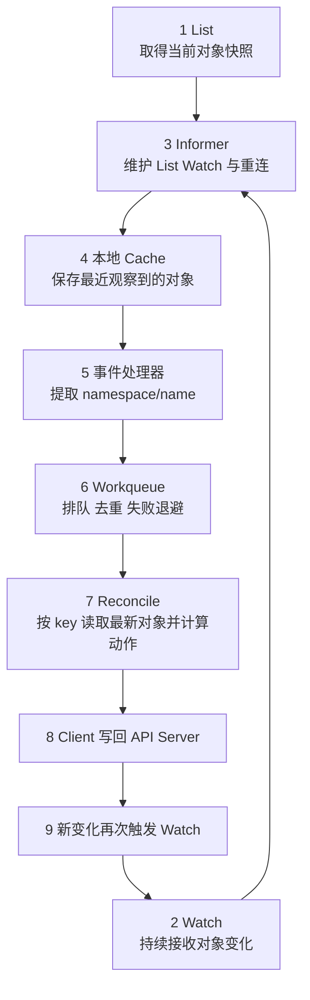

每个名词的职责如下：

| 名词 | 在哪里 | 负责什么 | 不负责什么 |
| --- | --- | --- | --- |
| Informer | Controller 进程内部的客户端库 | List、Watch、断线重连、更新本地缓存、分发事件 | 不决定应该创建几个 Pod |
| Cache | Controller 进程内存 | 保存最近观察到的对象，减少每次 Reconcile 都请求 API Server | 不是事实来源，可能短暂落后于 API Server |
| Event Handler | Controller 进程内部 | 把对象变化转换为待处理 key，通常是 `namespace/name` | 通常不在这里执行复杂业务逻辑 |
| Workqueue | Controller 进程内存 | 排队、合并重复 key、控制并发、失败后限速重试 | 不保存 Kubernetes 业务状态 |
| Reconcile | Controller 的业务入口 | 根据 key 读取最新对象，计算并执行本次幂等动作 | 不假设每个事件只出现一次，也不依赖严格事件顺序 |

例如 `default/training-job` 在短时间内被修改三次，队列不一定要求 Reconcile 严格消费三个完整事件。它可以只保留“这个 key 需要重新处理”。Reconcile 随后从 Cache 或 API Server 读取该对象的最新版本，以当前事实重新计算。

这也是为什么 Controller 必须幂等：同一个 key 可能因为重复事件、定期同步或失败重试被处理多次。无论执行一次还是多次，最终资源都应该收敛到相同结果。

Controller-runtime 为本项目提供了 Informer、Cache、Workqueue 和 Worker 管理。`Reconcile` 是我们填入领域规则的位置。Scheduler 和 kubelet也使用 Watch 与本地状态，但它们有各自专门的调度队列和节点同步机制，不能把所有组件都简单称为 Controller Informer。

### 先记住 Controller、Scheduler 和 kubelet 的分工

| 组件 | 它回答的问题 | 典型输出 |
| --- | --- | --- |
| Controller | “为了满足上层对象的期望，还应该创建、更新或删除什么对象？” | Deployment Controller 创建 ReplicaSet，Job Controller 创建 Pod，AIJob Controller 创建 JobSet |
| Scheduler | “这个已经存在但尚未绑定的 Pod 应该去哪台 Node？” | 通过 API Server 写入 Pod Binding |
| kubelet | “已经分给本 Node 的 Pod 怎样在本机运行？” | 调用容器运行时，准备网络、存储、设备，并更新 Pod status |

一句话记忆：

> Controller 管“应该存在什么”，Scheduler 管“Pod 放在哪里”，kubelet管“怎样在这台机器上运行”。

Controller 和 Scheduler 都不创建容器进程。Controller 可以创建 **实际的 Pod API 对象**；Scheduler 不接收所谓“创建计划”，它观察的就是已经持久化的 Pod 对象。

### 从一份 Job YAML 到容器进程

假设用户提交一个需要四个 Worker 的 Job。完整过程如下：

这里还会出现几个运行时术语：

- **Admission**：API Server 持久化对象前运行的准入阶段，可做默认值填充、策略校验或对象修改；
- **CNI**：容器网络接口规范，kubelet通过实现该规范的网络插件为 Pod 配置网络；
- **CRI**：kubelet调用容器运行时的接口规范，本实验中运行时实现是 containerd；
- **Pod Sandbox**：容器运行时为一个 Pod 准备的共享运行环境，通常包括网络 namespace；业务容器随后加入其中；
- **OCI runtime**：最终按照 OCI 规范创建容器 Linux 进程的底层运行时，例如 runc。
- **Probe**：kubelet对已启动容器执行的检查；startup 判断启动是否完成，readiness 判断是否接收流量，liveness 判断是否需要杀死并重启容器。

下面画的是“从 Job 到容器”的系统状态机，不是 Kubernetes 官方只针对单个 Pod 定义的 `status.phase` 状态机：

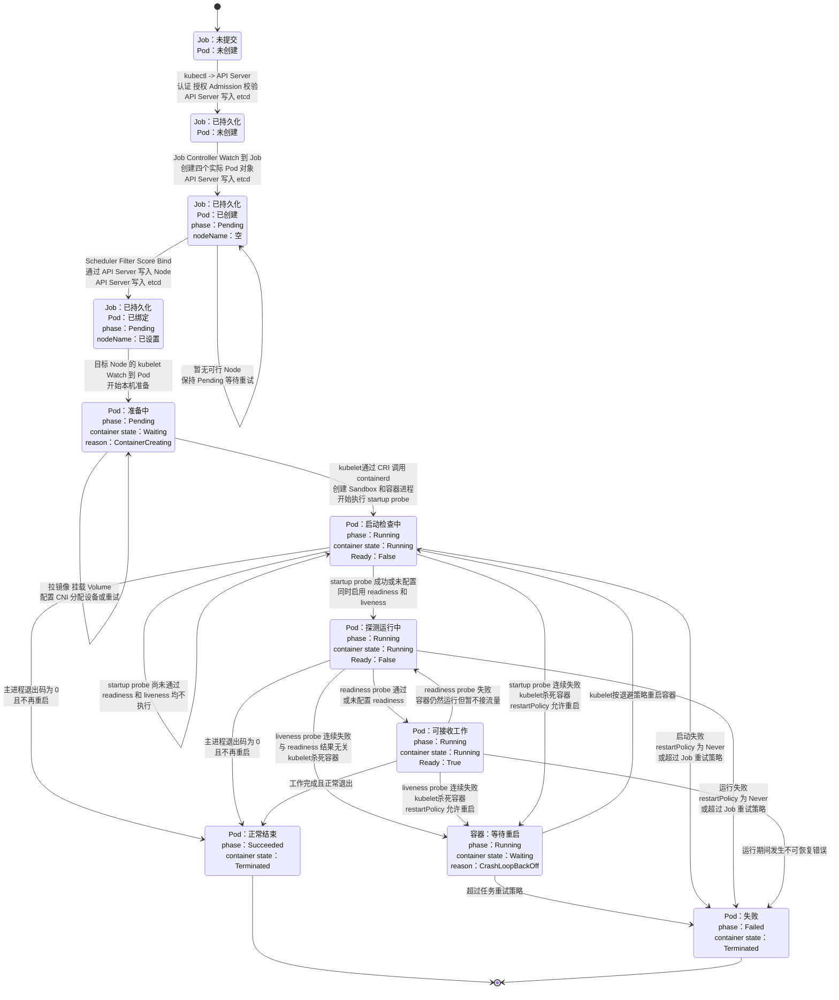

读图时注意：转移边上的组件负责推动变化，状态框描述 API Server 中可以观察到的对象状态。API Server 负责校验、持久化和发布 Watch 事件，但不替 Controller、Scheduler 或 kubelet做决策。

### startup、readiness 和 liveness probe 在哪一步

三种 probe 都发生在 Scheduler 完成绑定、kubelet已经通过 containerd 启动容器之后。它们是 kubelet的本机检查，不是 Controller 的 Reconcile，也不由 API Server 主动执行。

| Probe | 什么时候执行 | 失败后的效果 | 是否重启容器 |
| --- | --- | --- | --- |
| startup | 容器启动后；配置时会暂时屏蔽 readiness 和 liveness | 达到失败阈值后，kubelet杀死容器 | 取决于 `restartPolicy` |
| readiness | startup 成功或未配置 startup 后，周期执行 | `Ready=False`，Service Endpoint 不再把流量发给该 Pod | 不重启 |
| liveness | startup 成功或未配置 startup 后，周期执行 | 达到失败阈值后，kubelet杀死容器 | 取决于 `restartPolicy` |

因此不存在“先 readiness 还是先 liveness”：如果配置了 startup，必须先等 startup 成功；之后 readiness 和 liveness 独立地按各自的 `initialDelaySeconds`、`periodSeconds`、`timeoutSeconds` 与阈值运行。liveness 不等待 readiness 成功。

readiness 回答“现在能不能接流量”，liveness 回答“进程是否已经坏到应该重启”。一个容器可以处于 `Running` 且 `Ready=False`，同时继续接受 liveness 检查；liveness 失败也不会把 Pod 送回 Scheduler，Pod 仍绑定在原 Node 上，由该 Node 的 kubelet处理容器重启。

本项目生成的 Worker Pod 使用：

```yaml
restartPolicy: Never
```

因此如果以后给 Worker 加 liveness probe，探测达到失败阈值后 kubelet会杀死容器，但不会在同一个 Pod 内重启它。容器以失败状态终止后，Pod 通常进入 `Failed`；随后是否创建新 Pod 由 Job 的重试策略决定。本项目同时设置 `backoffLimit: 0`，因此教学示例不会自动重试失败 Worker。

这里需要区分三个概念：

- **Pod 模板**：Deployment、Job 或 JobSet spec 中用于生成 Pod 的模板；
- **Pod API 对象**：Controller 调用 API Server 后真正创建并持久化的对象；
- **容器进程**：kubelet和 containerd 根据已绑定的 Pod 对象在 Node 上创建的 Linux 进程。

因此“创建 Pod”在不同语境中可能被混用。严格说：Controller 创建 Pod API 对象，Scheduler 绑定 Pod，kubelet和 runtime 创建容器进程。

### Pending 是谁标记的

`Pending` 不是 Controller 向 API Server 汇报“工作完成”时手工设置的标记。Pod 被 API Server 接受后，在主容器成功启动前通常处于 Pending 生命周期阶段。

Scheduler 完成 Binding 后，Pod 仍可能因为镜像拉取、Volume 挂载、CNI、GPU 分配、init container 或 runtime 问题停留在 Pending。Readiness 失败则通常是 `Running` 但 `READY 0/1`，不是 Pending。

最短排查路径：

```bash
kubectl get pod <pod> -o wide
kubectl describe pod <pod>
kubectl get events --sort-by=.lastTimestamp
```

- `nodeName` 为空：看 Scheduler 事件，例如 CPU、内存、GPU、亲和性、污点或 PVC 不满足；
- `nodeName` 已设置：看 kubelet阶段，例如镜像、Volume、CNI、设备或 runtime；
- `Running` 但 `0/1 Ready`：再看 readiness probe 与应用日志；
- `CrashLoopBackOff`：看容器退出原因、启动日志和 liveness probe。

### 可以把 API Server 理解成后端、etcd 理解成数据库吗

作为第一层理解，这个类比是成立的：

| Kubernetes 组件 | Web 系统类比 | 实际职责 |
| --- | --- | --- |
| API Server | 后端 API / 统一网关 | 暴露 Kubernetes REST API，完成认证、授权、Admission、默认值、Schema 校验、版本转换和并发控制 |
| etcd | 数据库 / 持久化层 | 保存 Kubernetes API 对象及其版本，是集群状态的事实来源 |
| Controller / Scheduler | 后台 Worker | 持续观察对象，进行计算，然后通过 API Server 创建或更新对象 |
| kubelet | 每台机器上的执行 Agent | 观察分配给本 Node 的 Pod，调用容器运行时并上报状态 |

但不能把它理解成传统的同步调用链：

```text
组件请求 API Server
  -> API Server 返回下一步命令
  -> 组件执行命令
```

API Server 通常不告诉 Controller 或 Scheduler“下一步该做什么”。它主要提供资源状态与事件流。以 Controller 为例，执行机制是：

```text
Informer 首次 List 并建立本地 Cache
  -> Informer 通过 Watch 持续更新 Cache
  -> Event Handler 把对象 key 放入 Workqueue
  -> Reconcile 按 key 读取最新对象
  -> 根据期望状态和观察结果计算下一动作
  -> Client 调用 API Server 写回资源或 status
  -> 写回产生新 Watch 事件并再次调谐
```

因此更准确的说法是：API Server 类似“统一后端接口 + 资源模型 + 事件流入口”，etcd 是它背后的持久化层；Controller、Scheduler 和 kubelet是独立的异步 Worker。Controller 通常通过 client-go 的 Informer Cache 读取对象，并不为每个判断都同步请求 API Server。

### Controller 和 Scheduler 如何接力

Controller 与 Scheduler 不直接通信，也没有 `controller.Schedule(pod)` 这样的调用。它们通过 API Server 中的 Pod 对象接力：

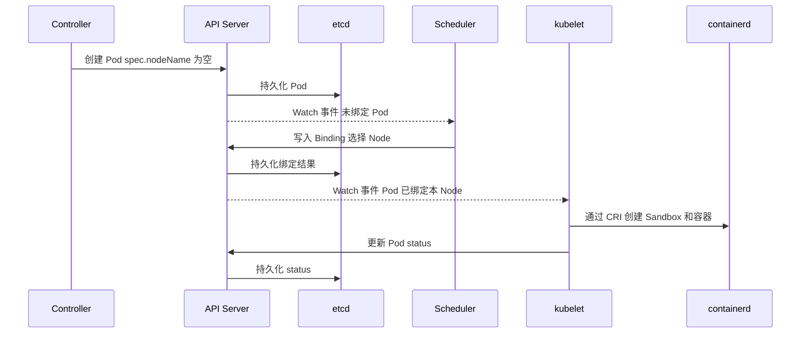

若业务方直接创建一个裸 Pod，可能完全没有 Controller 参与：API Server 直接持久化 Pod，Scheduler 仍会为它选择 Node，kubelet仍会启动容器。Controller 的存在取决于是否有更上层对象需要持续维护，而 Scheduler 是否参与取决于 Pod 是否已经指定或绑定 Node。

### 后文会用到的术语地图

| 术语 | 所属层次 | 先记住什么 |
| --- | --- | --- |
| CRD | API 扩展 | 向 API Server 注册一种新的资源结构，例如 AIJob；CRD 是定义，AIJob 对象是数据 |
| OwnerReference | 对象生命周期 | 表示一个对象由另一个对象拥有，所有者删除后 Garbage Collector 可以清理下游对象 |
| Condition | status 表达 | 用 type、status、reason、message 表达对象当前处境，例如是否 Admitted 或 Completed |
| Leader Election | Controller 高可用 | 多副本 Controller 中通常只有 leader 执行写操作，leader 故障后其他副本接管 |
| Filter / Score / Bind | Scheduler 阶段 | Filter 排除不可用 Node，Score 比较剩余 Node，Bind 记录最终 Node |
| Device Plugin | 设备层 | 向 kubelet暴露 `nvidia.com/gpu` 等扩展资源，并在 Pod 启动时分配设备 |
| DRA | 设备层 | 用 DeviceClass、ResourceClaim、ResourceSlice 等 API 表达比“设备数量”更丰富的选择与分配 |
| JobSet | 作业生命周期 | 在多个 Kubernetes Job 之上提供分布式任务的整组生命周期和网络能力 |
| Kueue | 作业准入 | 在创建大量 Pod 前处理队列、配额、整组准入和跨 Node 拓扑 |

在这个基础上，本项目增加了下面的资源与控制器链：

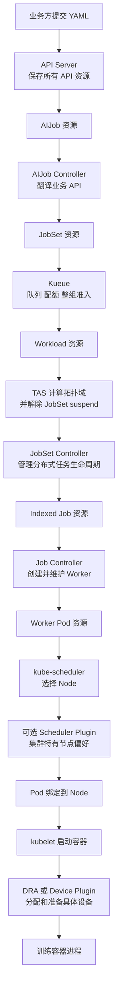

为保持图可读，第二张图省略了每个资源与 API Server 之间反复的 Watch/Write 箭头；图中的 `AIJob`、`JobSet`、`Workload`、`Job`、`Pod` 都实际保存在 API Server 中。关键点是：业务方只创建 `AIJob`，真正被 kube-scheduler 调度的是最下游的 Worker `Pod`。

### AIJob Controller

Controller 只负责 AI 领域 API 的适配：

1. 读取 `AIJob.spec`；
2. 生成或更新一个由它拥有的 `JobSet`；
3. 把 JobSet 的 Conditions 投影到 `AIJob.status`。

它不再逐个创建、删除和统计 Worker Pod。

### JobSet

JobSet 复用 Kubernetes Job，负责通用的分布式任务能力：

- 创建和管理一组 Indexed Job；
- 稳定的 Worker DNS；
- 完成、失败和整组重启策略；
- suspend/resume；
- leader/worker 等多模板任务。

### Kueue

Kueue 是 Job 级管理器，不替代 kube-scheduler。它在任务开始创建 Pod 之前决定：

- 队列是否有配额；
- 所有 Worker 是否能作为一组获得资源；
- 使用哪个 ResourceFlavor；
- Worker 应位于哪个 rack、block 或其他拓扑域。

AIJob 通过 JobSet 使用 Kueue 已有集成，不需要重新实现 Kueue 的 `GenericJob` 接口。

### kube-scheduler 和设备层

kube-scheduler 在可行 Node 中选择一个 Node。Scheduler Framework 插件可以补充公司特有的节点过滤或打分，但默认插件继续负责 CPU、内存、扩展资源、污点、Volume 和抢占。

选择 Node 内的具体 GPU 不属于普通 `ScorePlugin` 的职责。它应由以下组件负责：

- 传统集群：GPU Device Plugin 与 kubelet Topology Manager；
- 新集群：DRA Driver、`DeviceClass`、`ResourceClaim` 和 `ResourceSlice`；
- NVIDIA Multi-Node NVLink：支持 ComputeDomain 的 NVIDIA DRA Driver。

## 三、状态机与 Reconcile 的关系

前文已经说明 Controller-runtime 提供的 Informer、Cache 和 Workqueue。它还管理并发 Worker、失败退避和 Leader Election，业务代码不需要再次实现这些执行设施。

这里需要强调执行机制与业务规则的边界：Informer 负责观察，Workqueue 负责安排处理，Reconcile 才负责本项目的业务决策。Reconcile 接收的不是严格有序、仅消费一次的领域事件；通知可能重复、合并或延迟，Controller 也可能在任意一步崩溃，因此 API Server 中的资源才是事实来源。

工程上通常把一次 Reconcile 拆成下面的阶段：

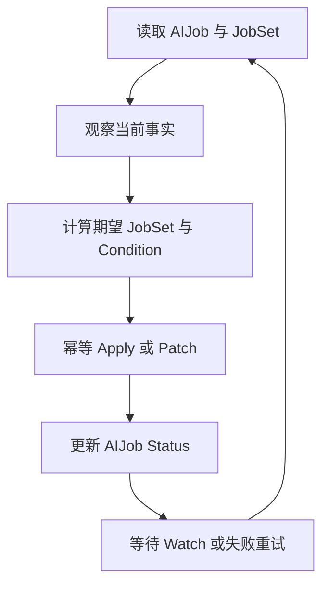

程序员维护的是 `观察结果 -> 下一动作和状态` 的业务规则；Controller-runtime 维护执行机制。复杂任务可以显式定义状态和转移函数，但每次处理仍需幂等，并能从 Kubernetes 资源重建状态。

本项目的状态以标准 Condition 表达，而不是只维护一个容易过期的枚举：

```yaml
status:
  observedGeneration: 3
  conditions:
    - type: Ready
      status: "False"
      reason: WaitingForAdmission
      observedGeneration: 3
```

`observedGeneration` 用来区分 Condition 描述的是当前 spec，还是用户修改前的旧 spec。

## 四、先理解 GPU 为什么需要互连

### 先区分 Kubernetes 对象与物理设备

Kubernetes 直接认识的是 `Pod` 和 `Node`，并不内置 `Rack` 对象。一个 Pod 最终被绑定到一个 Kubernetes Node，而这个 Node 在生产集群中通常对应一台物理服务器或虚拟机：

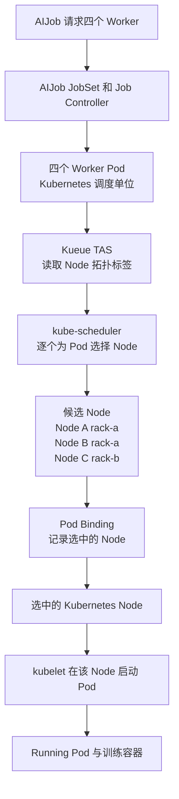

这里的 `rack=rack-a` 是普通 Node label。集群管理员、机房资产系统或基础设施控制器根据真实机房信息写入标签；API Server 只保存这个字符串，并不知道“机架”的物理含义。

本实验通过 Kueue `Topology` 告诉 Kueue 应如何解释这些标签：

```yaml
apiVersion: kueue.x-k8s.io/v1beta1
kind: Topology
spec:
  levels:
    - nodeLabel: infra.example.io/rack
    - nodeLabel: kubernetes.io/hostname
```

Kueue 因此先按 `infra.example.io/rack` 分组，再按主机名区分 Node。`same-rack` 的语义来自 AIJob Controller 与这份 Kueue 配置，不是 Kubernetes 内置关键字。

### Rack 与服务器内部是什么关系

从物理世界看，Rack 包含服务器；服务器内部再包含 CPU、内存、PCIe 设备和 GPU。Kubernetes Node 是对整台服务器的逻辑表示，不是 Rack 的子资源：

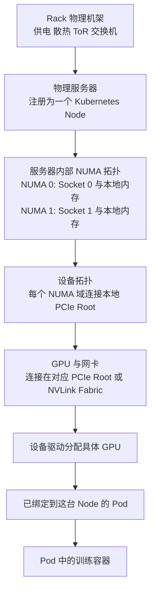

这张图混合了两类有方向的关系：`Rack -> Server -> NUMA -> PCIe -> GPU` 是物理包含和连接；`GPU -> 设备驱动 -> Pod -> 容器` 是设备分配及使用链。Pod 已通过上一张图绑定到这台服务器，本图继续展开该服务器内部的数据路径。

各层可以这样理解：

| 名称 | 是什么 | 本项目如何表示 |
| --- | --- | --- |
| Cluster | 一组共享同一个 Kubernetes 控制面的 Node | 整个 kind 集群 |
| Rack | 安装多台服务器、交换机和供电设备的物理机柜；不是 Kubernetes 内置对象 | Node 标签 `infra.example.io/rack` 间接表达 |
| Node | Kubernetes 注册的一台工作机器，可以是物理机或虚拟机 | `kubectl get nodes` 中的一行 |
| Pod | Kubernetes 的最小调度单位，包含一个或多个容器 | Job Controller 为每个 Worker 创建一个 Pod |
| CPU Socket | 主板上的一个 CPU 封装；双路服务器有两个 Socket | 本实验没有模拟 |
| NUMA Node | 一组 CPU 核、离它们较近的内存及 PCIe 设备构成的局部域 | 本实验没有模拟 |
| GPU | 连接在某个 PCIe/NVLink 拓扑中的具体加速设备 | 只用 `example.com/gpu` 模拟数量 |

这里有一个容易踩坑的命名冲突：

- **Kubernetes Node** 是一整台可调度机器；
- **NUMA Node** 是一台机器内部的硬件局部域。

它们都叫 Node，但尺度完全不同。一台 Kubernetes Node 内可以包含多个 NUMA Node。

### 什么是 NUMA

NUMA 是 Non-Uniform Memory Access，即“非一致内存访问”。在多路服务器中，每颗 CPU 通常有自己直接连接的本地内存和 PCIe 设备：

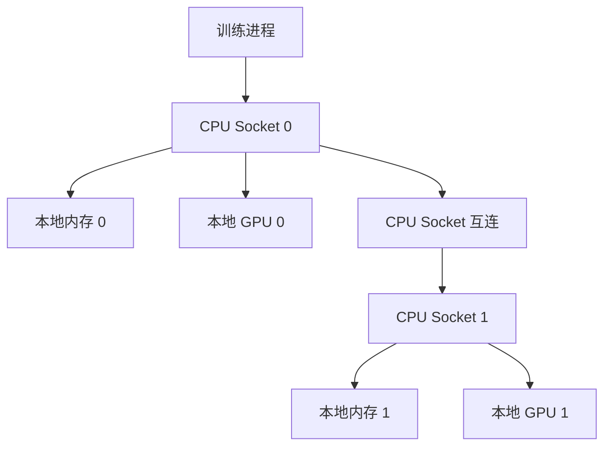

CPU0 访问自己的内存 0 或本地 GPU 0，路径通常更短；访问 CPU1 一侧的内存 1 或 GPU 1，需要经过 Socket 间互连。所谓“非一致”就是访问不同位置的延迟和带宽不相同，并不是内存内容不一致。

这会影响 AI 工作负载：即使 Pod 已经落到正确服务器，如果训练进程运行在 NUMA 0 的 CPU 核上，却频繁使用 NUMA 1 下的 GPU 或网卡，数据路径仍可能绕远。生产环境会结合 CPU Manager、Topology Manager、设备驱动或 DRA 做 CPU、内存、GPU 和网卡的对齐。本实验只演示 Node 级调度，不提供 NUMA 级保证。

### Rack 为什么影响调度

同一 Rack 中的服务器通常接入相同的机架顶部交换机（Top-of-Rack Switch，ToR）。跨 Rack 通信还要经过更上层的交换网络，因此可能有更长路径、更多竞争和不同故障域。

把 Worker 放在同一 Rack 的好处可能是通信路径较近；代价是它们也更容易同时受到同一机架交换机、供电或散热故障影响。因此：

- 通信密集型训练可能偏好或要求 `same-rack`；
- 高可用服务反而可能要求副本分散到不同 Rack；
- 拓扑策略不是固定的“越近越好”，而是性能与容错目标之间的选择。

本项目用 Kueue TAS 处理 `same-rack`，因为它需要在创建 Pod 前为整个 Worker 集合判断同一 Rack 是否有足够配额。普通 Scheduler Plugin 每次只给一个 Pod 的 Node 打分，无法可靠完成整组准入。

### 多张 GPU 为什么要通信

一张 GPU 有自己的计算单元和显存。模型或一个训练批次放不进单张 GPU 时，训练框架会把工作拆到多张 GPU：

- 数据并行：每张 GPU 处理不同数据，随后交换并聚合梯度；
- 张量并行：一个算子被切到多张 GPU，计算过程中频繁交换中间结果；
- 流水线并行：模型的不同层位于不同 GPU，前后阶段传递激活值和梯度。

拆分使更多 GPU 能共同工作，但也引入了通信。如果 GPU 很快、通信路径很慢，计算单元就会等待数据，增加 GPU 数量反而不一定按比例增加吞吐。因此调度不仅关心“有几张 GPU”，还关心“这些 GPU 之间怎么连接”。

NCCL 是训练框架常用的 NVIDIA 集合通信库。以 AllReduce 为例，每个 Worker 计算出局部梯度后，NCCL 沿可用的 NVLink、PCIe 或网络路径完成聚合。Kubernetes 不执行这些通信，但它决定 Pod 落在哪里，因此会间接决定 NCCL 能使用什么路径。

### PCIe：通用设备总线

PCI Express（PCIe）是服务器中连接 CPU、GPU、网卡和 NVMe 等设备的通用总线。可以先把它理解为设备进入主机系统的基础通道。

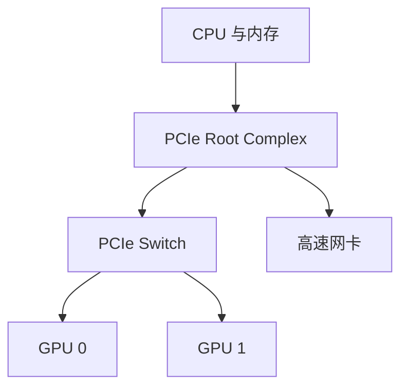

PCIe 的几个关键概念：

- **代际和通道数**：例如 Gen4 x16，代际与 lane 数共同影响理论带宽；
- **Root Complex**：CPU/内存系统进入 PCIe 树的根；
- **PCIe Switch**：扩展出多个下游端口，让多张 GPU 共享或直接经过同一个交换层；
- **NUMA**：双路服务器中，每个 CPU 有本地内存和本地 PCIe 设备。访问另一颗 CPU 下的设备通常需要跨 socket。

“GPU 在同一台机器”并不代表路径相同。两张 GPU 可能位于同一 PCIe Switch 下，也可能分属不同 Root Complex，后者的通信路径通常更长，还可能与 CPU 内存或网卡流量竞争带宽。

### NVLink 与 NVSwitch：GPU 专用高速互连

NVLink 是 NVIDIA 的 GPU 高速互连技术。与通用 PCIe 相比，它面向 GPU 间高带宽通信；具体带宽、链路数量和支持方式取决于 GPU 与服务器代际，所以工程上应读取真实拓扑，不能只凭型号名称假设。

两张 GPU 之间存在 NVLink，不代表机器中的每张 GPU 都两两直连。真实服务器可能是局部直连、环形或其他拓扑。NVSwitch 则提供交换结构，把多张 GPU 组织成更大的高速互连域：

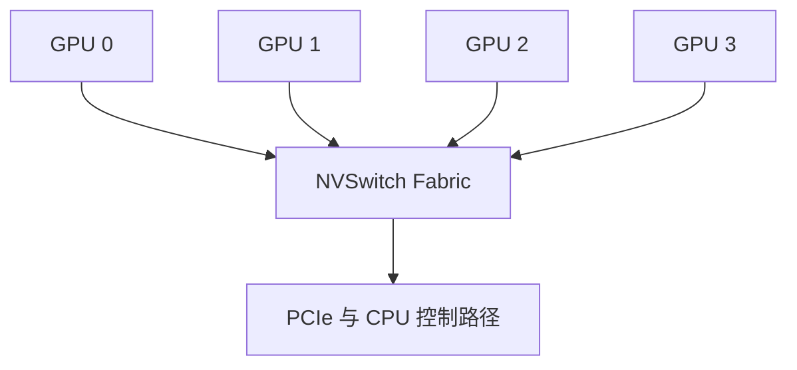

NVLink 并没有让 PCIe 消失。GPU 仍可能通过 PCIe 完成设备发现、控制、CPU-GPU 数据传输或连接其他设备。更准确的理解是：一台服务器内可以同时存在 PCIe 拓扑和 NVLink/NVSwitch 拓扑，通信库根据数据两端和硬件能力选择路径。

### 如何读 `nvidia-smi topo -m`

在真实 NVIDIA GPU 节点上，下面的命令会展示 GPU、CPU 和网卡之间的拓扑：

```bash
nvidia-smi topo -m
```

简化输出可能类似：

```text
        GPU0  GPU1  GPU2  NIC0  CPU Affinity
GPU0     X    NV4   PHB   PIX   0-31
GPU1    NV4    X    PHB   PIX   0-31
GPU2    PHB   PHB    X    SYS   32-63
NIC0    PIX   PIX   SYS    X
```

常见标记不是性能分数，而是路径类型：

| 标记 | 简化含义 |
| --- | --- |
| `X` | 同一个设备 |
| `NV#` | 经过若干条聚合的 NVLink，例如 `NV4` |
| `PIX` | 最多经过一个 PCIe bridge，通常路径较近 |
| `PXB` | 经过多个 PCIe bridge，但不经过 CPU 的 PCIe Host Bridge |
| `PHB` | 经过 PCIe Host Bridge，通常到达 CPU Root Complex |
| `NODE` | 还经过同一 NUMA 节点内的 Host Bridge 互连 |
| `SYS` | 还经过 NUMA 节点之间的 CPU 互连，通常路径更远 |

按这个示例，GPU0 与 GPU1 有直接 NVLink 路径；GPU0 与 NIC0 共享较近的 PCIe 路径；GPU2 靠近另一组 CPU 核，访问 NIC0 要跨 NUMA。一个通信密集任务若拿到 GPU0 和 GPU1，通常比拿到 GPU0 和 GPU2 更理想。

拓扑矩阵仍只是结构信息，不是性能测试。链路是否启用、P2P 是否可用、容器是否正确暴露 `/sys`、BIOS/IOMMU 设置和并发流量都会影响结果。可以继续使用：

```bash
nvidia-smi topo -p2p p  # 检查 GPU 间 PCIe P2P 能力
nvidia-smi topo -p2p n  # 检查 GPU 间 NVLink P2P 能力
```

再用 `nccl-tests` 或 `nvbandwidth` 测量实际带宽。工程上应以“发现拓扑 + 验证能力 + 性能测试”形成标签和调度策略，而不是只抓取一个型号字段。

### 跨服务器：网卡、RDMA 与机架

传统服务器中的 NVLink 和 PCIe 首先描述单机内设备路径。Worker 分布在不同服务器时，数据通常要经过 GPU、PCIe、网卡和交换网络。RDMA 允许数据绕过较多 CPU 软件栈开销；GPUDirect RDMA 进一步支持网卡与 GPU 显存之间的高效数据传输。InfiniBand 和 RoCE 是 AI 集群常见的 RDMA 网络方案。

新一代 NVLink Switch 系统也可以把 NVLink fabric 扩展到多个计算节点甚至机架级域。这是特定整机与交换架构提供的能力，不能因为 GPU 支持 NVLink 就假设普通集群天然具备跨机 NVLink。

`same-rack` 表示多个 Worker 尽量或必须位于同一机架拓扑域。它可以减少跨汇聚层通信并利用机架内网络，但仍不自动保证：

- 节点装有 RDMA 网卡；
- 网卡与 GPU 位于合适的 NUMA/PCIe 路径；
- 网络没有拥塞或超售；
- Worker 获得了同一个 NVLink 域中的 GPU。

因此，`same-rack`、`nvlink` 和 `pcie` 不是同一层的三个互斥硬件型号。前者描述跨节点位置，后两者在本项目中描述节点内 GPU fabric 偏好。

### 从近到远看一次通信

下面是教学用的简化路径。真实机器的相对性能由硬件代际、链路宽度、NUMA、通信大小和并发流量共同决定，不能把它当成固定性能公式。

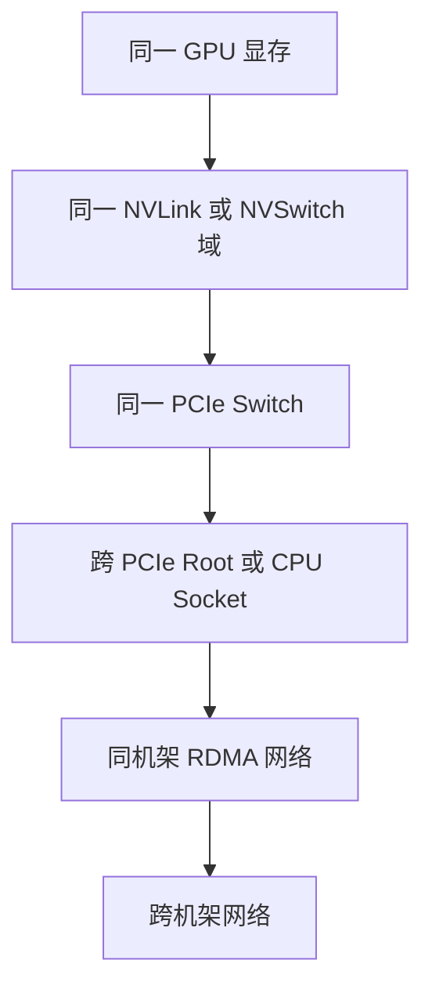

排查真实 GPU 服务器时，常用 `nvidia-smi topo -m` 查看 GPU、CPU 和网卡的连接矩阵，再用 NCCL 测试验证实际带宽与延迟。调度系统使用的标签或 DRA 属性，应来自这类硬件发现结果，而不是人工猜测。

### 这些概念如何映射到本项目

| `AIJob.spec.topology` | 当前代码如何处理 | 能保证什么 | 不能保证什么 |
| --- | --- | --- | --- |
| `nvlink` | 给 Pod 加偏好注解，Scheduler Plugin 给 `gpu-fabric=nvlink` 的 Node 更高分 | 在其他条件相同时更偏向标为 NVLink 的 Node | 不是硬约束；不选择具体 GPU；不证明 GPU 两两 NVLink 相连 |
| `pcie` | 给 Pod 加偏好注解，对 NVLink Node 打 100 分、PCIe Node 打 80 分 | 允许使用高速 Node，同时偏好至少有 PCIe GPU 能力的 Node | 不保证 GPU 位于同一 PCIe Switch 或 NUMA 节点 |
| `same-rack` | 转换为 Kueue TAS 的 required topology 注解 | 整个 PodSet 准入到同一 rack 拓扑域 | 不保证节点内 GPU 路径，也不保证 RDMA 网络质量 |

这里 `pcie` 的含义不是“拒绝 NVLink”。NVLink 机器仍然拥有 PCIe，并且通常是更好的节点，因此当前评分让 NVLink Node 得 100 分、普通 PCIe Node 得 80 分。如果业务需要“必须位于某类设备拓扑”，就不应只用 `ScorePlugin`，而应使用 Filter、node affinity，或更适合设备级约束的 DRA。

## 五、拓扑需求应定义在哪里

“拓扑”至少包含三个层次，不能只用一个 Node Label 解决。

| 层次 | 示例 | 负责组件 |
| --- | --- | --- |
| 跨节点放置 | 同 rack、同 leaf switch、同 NVLink domain | Kueue TAS |
| Node 选择 | GPU 型号、缓存命中、公司特有评分 | kube-scheduler 默认插件或自定义插件 |
| Node 内设备 | 同 NUMA、同 PCIe root、GPU 间 NVLink | DRA/Device Plugin/Topology Manager |

### 跨节点拓扑

Kueue TAS 面向整个 PodSet 做资源准入，而不是等第一个 Worker 调度后再让其他 Worker 跟随。生产中可以把 AIJob 的严格性翻译为 JobSet PodTemplate 上的注解：

```yaml
metadata:
  annotations:
    kueue.x-k8s.io/podset-required-topology: topology.kubernetes.io/rack
```

如果只是偏好同一拓扑域，则使用 `podset-preferred-topology`。具体键由集群管理员在 Kueue `Topology` 中定义。

### Node 内 GPU 拓扑

普通 Scheduler Plugin 只给 Node 打分，无法保证容器最终拿到哪几张 GPU。要表达“多张 GPU 共享 PCIe root”或“设备之间存在 NVLink”，设备驱动需要把这些属性发布为 DRA 设备属性，再由 `ResourceClaim` 的 selector/constraint 请求合适的设备组合。

本实验没有真实 GPU，所以只能用 Node Label 模拟节点级 `nvlink` 和 `pcie` 偏好。这是教学替身，不是生产设备分配方案。

## 六、项目阅读顺序

前文建立了理解源码所需的 Kubernetes、JobSet、Kueue 和 GPU 拓扑背景。实际跟读代码时，请转到[源码阅读指南](code-reading-guide.md)：它按 `AIJob` 从声明、Reconcile、调度到 Worker 的数据流列出文件和关键函数，并提供按问题回查的索引。本文后续章节继续解释设计目标和实现边界，不维护重复的文件目录。

## 七、AIJob Controller 的目标形态

入口声明它管理 AIJob，并监听自己创建的 JobSet：

```go
return ctrl.NewControllerManagedBy(manager).
    For(&aiv1alpha1.AIJob{}).
    Owns(&jobsetv1alpha2.JobSet{}).
    Complete(r)
```

Go 通过方法集合隐式实现接口，可以用编译期断言明确契约：

```go
var _ reconcile.Reconciler = &AIJobReconciler{}
```

Reconcile 的主路径保持在同一抽象层：

```go
func (r *AIJobReconciler) Reconcile(ctx context.Context, req ctrl.Request) (ctrl.Result, error) {
    job, err := r.loadAIJob(ctx, req.NamespacedName)
    if err != nil {
        return ctrl.Result{}, client.IgnoreNotFound(err)
    }

    desired := desiredJobSet(job)
    if err := r.applyJobSet(ctx, job, desired); err != nil {
        return ctrl.Result{}, err
    }
    return ctrl.Result{}, r.reconcileStatus(ctx, job, desired)
}
```

辅助函数分别负责读取、构造、写入和状态归约，避免一个函数同时处理所有细节。所有写入都必须允许重复执行。

OwnerReference 仍由下面的调用设置：

```go
ctrl.SetControllerReference(aiJob, jobSet, r.Scheme)
```

删除 AIJob 后，Kubernetes Garbage Collector 会回收 JobSet；JobSet Controller 再清理其拥有的 Job 和 Pod。

JobSet 的 `network`、ReplicatedJob 模板等关键字段是不可变的，而且 JobSet 与 Kueue 的 webhook 会在创建时补充默认值、NodeSelector、SchedulingGate 和内部注解。因此 Controller 只在首次创建 JobSet 时写入 spec，后续 Reconcile 不用原始模板覆盖实际对象。

为避免用户修改 AIJob 后产生“YAML 已更新、实际 JobSet 没更新”的假象，本教学 API 把 `AIJob.spec` 也定义为创建后不可变。修改 Worker 数、镜像或拓扑时应重新创建作业：

```bash
kubectl delete aijob demo-training
kubectl apply -f examples/aijob.yaml
```

生产平台还可以实现显式的升级策略，例如仅允许 suspended 作业重建 JobSet，或为每次 revision 创建新 JobSet；这属于产品语义，不能由通用 Reconcile 自动猜测。

## 八、Scheduler Plugin 的合理边界

插件通过编译期断言实现 Framework 接口：

```go
var _ framework.ScorePlugin = &Plugin{}
```

它只对已经通过默认硬约束的 Node 增加分数：

| AIJob 偏好 | Node 标签 | 分数 |
| --- | --- | ---: |
| `nvlink` | `gpu-fabric=nvlink` | 100 |
| `nvlink` | `gpu-fabric=pcie` | 50 |
| `pcie` | `gpu-fabric=nvlink` | 100 |
| `pcie` | `gpu-fabric=pcie` | 80 |
| 其他情况 | 无匹配 | 0 |

默认 `NodeResourcesFit` 会检查 Pod 的扩展资源请求，因此插件不重复统计 GPU。它也不处理 Taint、Volume、CPU、内存和抢占。

`same-rack` 不再通过“查找已经运行的第一个 Worker”实现。这个做法不能保证整组资源可用，会产生部分 Worker 已运行、其余 Worker 无处可放的情况。整组机架约束交给 Kueue TAS。

### 注册插件

Scheduler Framework 插件需要编译进 kube-scheduler 二进制：

```go
metrics := gputopology.NewMetrics(legacyregistry.Registerer())
plugin := app.WithPlugin(gputopology.Name, gputopology.NewFactory(metrics))
command := app.NewSchedulerCommand(plugin)
```

Scheduler profile 再启用对应扩展点：

```yaml
profiles:
  - schedulerName: ai-scheduler
        plugins:
          score:
            enabled:
              - name: GPUTopology
                weight: 5
```

`GPUTopology` 只实现 `ScorePlugin`，因此只能在 `score` 扩展点启用。把它同时写进
`preScore` 会要求插件实现另一个接口，Scheduler 会在启动时拒绝这份配置。

这个实验额外运行一个 `ai-scheduler`，不替换 kind 自带的 `default-scheduler`。JobSet 创建的 Worker Pod 通过 PodTemplate 中的 `schedulerName` 使用它。

## 九、安装和运行

本地实验固定使用 Kubernetes 1.34.8、Go 1.24、JobSet 0.10.1 和 Kueue 0.14.3，还需要 Docker、kubectl、kind、make 和 Bash，不需要真实 GPU。Go 依赖使用 Kubernetes 1.34.1，和集群保持相同 minor；`make deploy` 会安装固定版本的 JobSet 和 Kueue。

先确认本地工具可用：

```bash
docker version
kubectl version --client
kind version
go version
```

项目的运行顺序如下。建议为实验集群指定独立名称，避免覆盖本机已有的 kind 集群：

```bash
make test
make cluster CLUSTER=ai-infra-lab-v134
kubectl config current-context
make deploy CLUSTER=ai-infra-lab-v134
make demo
```

`make cluster` 会把当前 kubectl context 切换到新集群。`make deploy` 中的 kubectl 命令使用当前 context，因此部署前应确认输出是 `kind-ai-infra-lab-v134`。`CLUSTER` 参数同时告诉 kind 应把本地业务镜像加载到哪个集群。

部署顺序是：

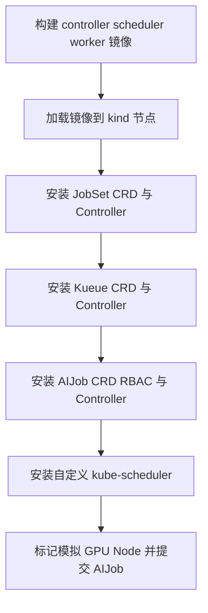

### 镜像源

构建阶段包含两个来源：

- `golang:1.24.0` 来自 Docker Hub，可以使用 Docker daemon 的 `registry-mirrors` 加速；
- distroless 原始镜像位于 `gcr.io`，Docker Hub mirror 不会代理它。

本项目默认通过 `m.daocloud.io` 获取 distroless。该地址是用于本地实验的第三方代理；生产构建应使用组织自己的可信镜像仓库，并按 digest 固定基础镜像。切回官方地址：

```bash
make image RUNTIME_IMAGE=gcr.io/distroless/static-debian12:nonroot
```

`make deploy` 还会从 GitHub Release 安装 JobSet 和 Kueue 清单，这部分也不经过 Docker Hub mirror。

kind 没有 GPU Device Plugin。`scripts/label-nodes.sh` 会：

1. 给 Node 添加模拟的 fabric 和 rack 标签；
2. 在 Node status 中加入 `example.com/gpu` 扩展资源。

示例因此使用 `example.com/gpu`。生产环境应安装 GPU Operator、Device Plugin 或 DRA Driver，并改用真实资源与设备属性。

观察结果：

```bash
kubectl get aijob
kubectl get jobsets
kubectl get workloads.kueue.x-k8s.io
kubectl get jobs,pods -o wide
kubectl -n ai-infra-system logs deployment/aijob-controller
kubectl -n ai-infra-system logs deployment/ai-scheduler
```

一个正常运行的示例会经历 `AIJob -> JobSet -> Workload -> Job -> Pod`。可用下面的命令沿资源所有权逐层检查，而不是只看最终 Pod：

```bash
kubectl get aijob demo-training -o yaml
kubectl get jobset demo-training -o yaml
kubectl get workloads.kueue.x-k8s.io
kubectl get jobs,pods -l infra.example.io/aijob=demo-training -o wide
```

### 先把 Worker 当成一台可控的实验仪器

真实训练框架会引入模型、数据、通信和硬件故障，很难判断控制面实验究竟在哪里失败。仓库中的
Worker 故意只模拟生命周期，并用每行一个 JSON 的方式打印 `start` 和 `result` 记录。

| 参数 | 现象 | 适合验证 |
| --- | --- | --- |
| `--mode=complete --duration=5s` | 等待后成功退出 | 正常完成与 status 投影 |
| `--mode=complete --fail-indexes=1` | index 1 稳定非零退出 | 局部 Worker 失败传播 |
| `--startup-delay=3s` | 延迟进入工作阶段 | 启动时序 |
| `--mode=wait` 或省略参数 | 一直占用资源，直到收到终止信号 | benchmark holder |

Indexed Job 会通过 downward API 把
`batch.kubernetes.io/job-completion-index` 注入 `JOB_COMPLETION_INDEX`。直接在终端运行 Worker
时没有这个变量也不会崩溃，记录中的 `completionIndex` 会省略。

### 不安装 Prometheus 也能读指标

先在一个终端转发 Controller 的 HTTP Service：

```bash
kubectl -n ai-infra-system port-forward service/aijob-controller-metrics 8080:8080
curl http://127.0.0.1:8080/metrics | grep '^aijob_controller_'
```

Scheduler 保留 kube-scheduler 的鉴权 HTTPS 端点。创建短期 ServiceAccount token，再通过
Service 转发读取；`-k` 只用于接受本地实验中临时生成的服务证书：

```bash
kubectl -n ai-infra-system port-forward service/ai-scheduler-metrics 10259:10259
TOKEN="$(kubectl -n ai-infra-system create token ai-scheduler)"
curl -k -H "Authorization: Bearer ${TOKEN}" \
  https://127.0.0.1:10259/metrics | grep '^aijob_scheduler_'
```

标签只包含 `success/error/not_found`、`nvlink/pcie/other` 等有限类别。对象名称只出现在日志和
证据 YAML，不进入 metric label。

### 三层验证分别证明什么

```bash
make verify
make test-api
make test-e2e CLUSTER=ai-infra-lab-v134
```

第一层验证 API 序列化、Controller 转换、Worker 状态机、指标标签和碎片计算，不需要 Docker；
第二层用 envtest 的真实 API Server 验证创建、status 子资源和重复 Reconcile，但不声称验证
垃圾回收；第三层要求显式 kind context，验证部署后的完整链路、失败传播、Controller 替换与
owner-based cleanup。E2E 超时时会先在 `out/e2e/` 留下证据，再返回非零。

### 按“停在哪一层”诊断失败

| 现象 | 先看对象 | 再看证据 |
| --- | --- | --- |
| 配额或容量不足 | Workload 的 Admitted/QuotaReserved、PodScheduled | Kueue/Scheduler events 与 metrics |
| 指定 Worker 失败 | Pod exit code、Job Failed、JobSet/AIJob Conditions | Worker JSON log 与 Controller metrics |
| Controller 被替换 | Deployment/Pod UID、owned JobSet 数量 | 新旧 Controller log 与 reconcile counter |

三条可重复演练分别是：

```bash
make failure-capacity CLUSTER=ai-infra-lab-v134
make failure-worker CLUSTER=ai-infra-lab-v134
make failure-restart CLUSTER=ai-infra-lab-v134
```

每个命令只清理由自身 run ID 标记的 AIJob。证据目录中的 `manifest.json` 会列出 expected、
observed、文件索引和 completeness；即使超时，已有对象与日志仍会保留。

### 常见问题

如果 kind 节点日志出现 `Failed to create control group inotify object: Too many open files`，检查 WSL 的 inotify instance 上限：

```bash
sysctl fs.inotify.max_user_instances
sudo sysctl -w fs.inotify.max_user_instances=1024
```

这是宿主机 inotify instance 耗尽，不是节点镜像损坏。第二条只修改当前运行时；需要永久保留时，应通过 WSL 的系统配置管理，而不是写入项目脚本。

如果基础镜像报 DNS 或超时错误，先根据错误中的 registry 判断来源。`docker.io` 可以检查 daemon mirror，`gcr.io` 则应检查 `RUNTIME_IMAGE` 是否使用可访问的显式代理地址。

删除实验环境：

```bash
make clean CLUSTER=ai-infra-lab-v134
```

## 十、用对照实验观察资源碎片

现在可以把问题从“Pod 能否运行”提升为“不同 NodeResourcesFit 策略产生什么可观察差异”。
完整步骤、指标公式和报告方法见[调度实验指南](scheduling-experiment.md)。最短入口是：

```bash
make benchmark CLUSTER=ai-infra-lab-v134
```

runner 会顺序运行 `LeastAllocated` baseline 与 `MostAllocated` optimized profile，每次提交三个
2-GPU holder，再提交一个 4-GPU probe。它会恢复原 Scheduler 配置，并为每个 profile/repetition
写一份 schema-versioned JSON。模拟 GPU 只能证明调度与资源记账行为，不能推导真实 GPU 利用率、
NVLink 带宽或训练吞吐。

## 十一、什么时候才写自定义扩展

优先复用已有能力：

| 需求 | 首选组件 |
| --- | --- |
| Worker 生命周期、重试、稳定 DNS | JobSet / Kubernetes Job |
| 队列、配额、公平性、抢占 | Kueue |
| 同 rack、同 block、整组准入 | Kueue TAS |
| CPU、内存、GPU 数量、污点、Volume | kube-scheduler 默认插件 |
| NUMA 对齐 | kubelet Topology Manager |
| 具体 GPU、MIG、PCIe/NVLink 设备关系 | DRA 或厂商 Device Plugin |
| 公司特有且标准 API 无法表达的 Node 偏好 | Scheduler Framework Plugin |

扩展 Kubernetes 的核心不是尽可能多写 Controller 和 Scheduler，而是在正确的层只补齐标准组件没有表达的领域语义。

## 十二、进一步阅读

- [Kubernetes Controller](https://kubernetes.io/docs/concepts/architecture/controller/)
- [JobSet](https://jobset.sigs.k8s.io/docs/overview/)
- [Kueue 自定义 Job 集成](https://kueue.sigs.k8s.io/docs/tasks/dev/integrate_a_custom_job/)
- [Kueue Topology-Aware Scheduling](https://kueue.sigs.k8s.io/docs/concepts/topology_aware_scheduling/)
- [Kubernetes Scheduling Framework](https://kubernetes.io/docs/concepts/scheduling-eviction/scheduling-framework/)
- [Kubernetes Dynamic Resource Allocation](https://kubernetes.io/docs/concepts/scheduling-eviction/dynamic-resource-allocation/)
- [NVIDIA System Management Interface：拓扑命令](https://docs.nvidia.com/deploy/nvidia-smi/index.html#topology)
- [NCCL：GPU 通信与拓扑排错](https://docs.nvidia.com/deeplearning/nccl/user-guide/docs/troubleshooting/gpu_troubleshooting.html)
- [NCCL：性能测试与调优](https://docs.nvidia.com/deeplearning/nccl/user-guide/docs/troubleshooting/performance_and_tuning.html)
- [NVIDIA DRA Driver](https://docs.nvidia.com/datacenter/cloud-native/gpu-operator/latest/dra-intro-install.html)
