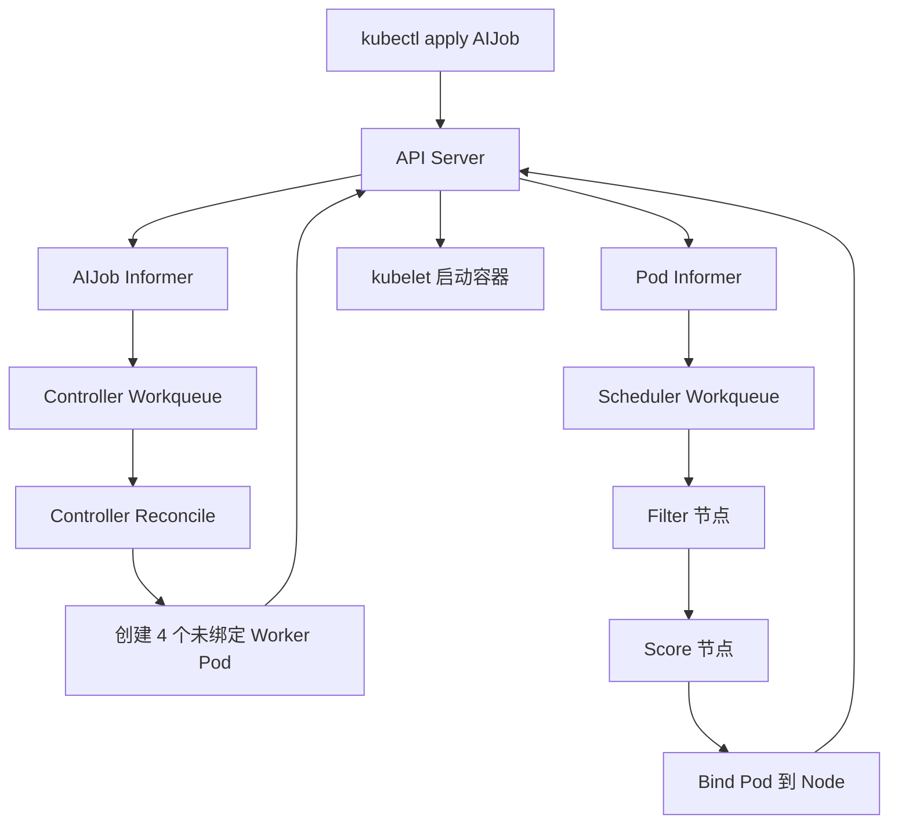
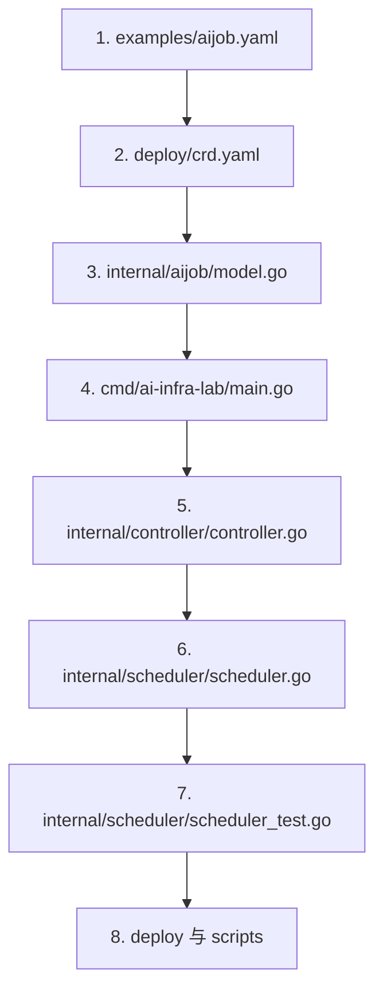

# 从零手写 Kubernetes Controller 与 Scheduler

这篇教程对应 `reference/ai-infra-learning.md` 中 AIJob Operator 的第一步：不使用 Kubebuilder 和 Scheduler Framework 的代码生成，直接用 `client-go` 看清 Controller 与 Scheduler 的主循环。

实验不会申请真实 GPU。每个 kind Worker Node 用两个 Label 表示硬件：

```text
infra.example.io/gpu-capacity=4
infra.example.io/rack=rack-a
```

Worker Pod 上的 `infra.example.io/gpu-request=2` 表示需要两张模拟 GPU。Scheduler 自己统计已绑定 Pod 的占用量。

## 一、最终会发生什么

提交一个 AIJob：

```yaml
apiVersion: infra.example.io/v1alpha1
kind: AIJob
metadata:
  name: demo-training
spec:
  workers: 4
  gpuPerWorker: 2
  topology: same-rack
```

系统中的数据流是：



Controller 决定“应该存在几个 Worker”，Scheduler 决定“每个 Worker 放到哪台 Node”。二者都只通过 API Server 协作，不直接调用对方。

## 二、准备环境

需要：

- Go 1.22 或更高版本；
- Docker；
- kubectl；
- kind；
- make 和 Bash。

仓库当前环境已经有 Go、Docker、kubectl、kind、make 和 Bash，不需要额外安装工具。首次执行 `go mod download`、Docker 构建和 kind 集群创建仍需要网络下载 Go 模块及容器镜像。

检查版本：

```bash
go version
docker info
kubectl version --client
kind version
make --version
```

不需要安装 Kubebuilder、Operator SDK、Helm、真实 NVIDIA Driver 或 Device Plugin。

## 三、项目结构与阅读顺序

建议沿着一个 AIJob 的生命周期阅读，而不是一开始逐行阅读全部代码：



1. `examples/aijob.yaml`：先看用户提交什么，明确输入是 Worker 数量、单 Worker GPU 请求和拓扑偏好。
2. `deploy/crd.yaml`：再看 API Server 如何校验这些字段，以及 status 子资源如何声明。
3. `internal/aijob/model.go`：理解 Dynamic Client 返回的非结构化对象如何转换成程序内部的 `Spec`。
4. `cmd/ai-infra-lab/main.go` 和 `internal/kube/config.go`：看进程如何选择组件，并在集群内外建立 Kubernetes Client。
5. `internal/controller/controller.go`：按 `New -> Run -> enqueue -> processNext -> reconcile` 阅读，跟踪 AIJob 如何变成 Worker Pod。
6. `internal/scheduler/scheduler.go`：按 `New -> Run -> enqueue -> schedule -> chooseNode -> Bind` 阅读，跟踪未绑定 Pod 如何选择 Node。
7. `internal/scheduler/scheduler_test.go`：用三个小场景验证 bin packing、same-rack 和容量不足，比直接进入 kind 调试更容易理解策略。
8. `deploy/rbac.yaml`、`deploy/deployment.yaml`、`scripts/label-nodes.sh` 和 `Makefile`：最后看组件需要什么权限，以及本地集群如何组装和运行。

第一次阅读先抓住 Controller 与 Scheduler 两条主链即可。`Dockerfile`、`.dockerignore` 和 `kind.yaml` 属于运行环境细节，可以在执行实验时再看。

## 四、先看 CRD：给 Kubernetes 增加 AIJob 类型

`deploy/crd.yaml` 定义 `infra.example.io/v1alpha1` API。最重要的是 schema 与 status 子资源：

```yaml
subresources:
  status: {}
schema:
  openAPIV3Schema:
    properties:
      spec:
        required: [workers, gpuPerWorker]
```

API Server 会拒绝 `workers: 0` 等非法输入。开启 status 子资源后，Controller 可以更新 `.status`，而不改动用户提交的 `.spec`。

这里故意使用 Dynamic Client 读取 CRD，因此不用生成 Go 类型、DeepCopy 和 Clientset。代价是字段读取缺少编译期类型检查；生产 Operator 通常会使用代码生成。

## 五、手写 Controller

入口在 `internal/controller/controller.go`。一个 Controller 有四个核心部件：

1. Informer：List/Watch API 对象，并维护本地缓存；
2. Event Handler：把发生变化的对象转换成 `namespace/name`；
3. Workqueue：去重、削峰，并为失败项提供指数退避重试；
4. Reconcile：比较期望状态与实际状态，执行最小修改。

启动流程是：

```go
c.start(ctx.Done())
if !cache.WaitForCacheSync(ctx.Done(), c.synced) {
    return fmt.Errorf("sync AIJob informer cache")
}
go wait.UntilWithContext(ctx, c.runWorker, time.Second)
```

必须先等待缓存同步。否则 Controller 可能把“缓存还没看见对象”误判成“对象不存在”。

队列消费者只做三件事：取 key、调用 reconcile、决定 Forget 或重试：

```go
if err := c.reconcile(ctx, key); err != nil {
    c.queue.AddRateLimited(key)
    return true
}
c.queue.Forget(item)
```

Reconcile 的期望状态是 `spec.workers` 个 Pod。它先按 Label 列出现有 Worker，再补齐缺少的 Pod。Pod 名称固定为 `<aijob>-worker-<index>`，因此同一个 reconcile 重复执行不会不断创建新对象，这就是幂等性。

每个 Worker 设置：

```go
SchedulerName: "ai-scheduler"
```

默认 kube-scheduler 会忽略它，只有我们的 Scheduler 会处理。OwnerReference 则让 Kubernetes Garbage Collector 在 AIJob 删除后自动删除 Worker。

Controller 也监听 Worker Pod 的变化并重新入队所属 AIJob，用于聚合 `pending/running/succeeded/failed` 状态。只有新状态与旧状态不同时才调用 UpdateStatus，避免 status 更新再次触发无意义的 reconcile 循环。

## 六、手写 Scheduler

入口在 `internal/scheduler/scheduler.go`。它同样采用 Informer + Workqueue，但只接收：

```text
spec.schedulerName == ai-scheduler
spec.nodeName == 空
```

一次调度周期分为三步。

### 1. Filter：过滤不可用节点

节点必须满足：

```text
gpu-capacity - 已用 GPU >= Pod 请求 GPU
```

`buildNodeStates` 从 Node Label 读取容量，再扫描仍在运行或等待启动的已绑定 Pod，累计使用量。终态 Pod 不再占用模拟 GPU。

### 2. Score：给可用节点打分

本实验的分数为：

```text
score = 已使用 GPU * 10
if 与同一 AIJob 的已有 Worker 同机架:
    score += 1000
```

“已使用 GPU 越多，分越高”是一种 bin packing：先填满部分节点，保留完整空闲节点，减少资源碎片。`same-rack` 奖励则演示拓扑感知。两个目标都是软约束，因为即使同机架放不下，任务仍可退化到其他机架。

### 3. Bind：提交调度结果

Scheduler 不直接修改 Pod 的 `spec.nodeName`，而是创建 Binding：

```go
binding := &corev1.Binding{
    Target: corev1.ObjectReference{Kind: "Node", Name: node},
}
client.CoreV1().Pods(namespace).Bind(ctx, binding, metav1.CreateOptions{})
```

API Server 完成绑定后，目标 Node 上的 kubelet 才会看到 Pod 并开始创建容器。因此“调度成功”不等于“容器已经运行”。镜像拉取、Volume 挂载或容器启动仍可能失败。

调度器在每次决策时直接向 API Server 查询 Pod 占用量，而不是只读 Informer 缓存。原因是 Bind 后缓存存在短暂延迟；队列中的下一个 Pod 如果读取旧缓存，可能重复使用刚刚分配的容量。生产调度器通常通过 assume/cache 机制解决，这里用直接查询保持实现容易理解。

## 七、运行完整实验

先运行单元测试：

```bash
make test
```

测试覆盖 bin packing、same-rack 偏好和容量不足三个核心决策。

创建一个有三个 Worker Node 的集群：

```bash
make cluster
```

`kind.yaml` 将节点版本固定为 Kubernetes 1.30，与 `client-go v0.30` 对齐。首次创建会拉取 `kindest/node:v1.30.13`；若网络较慢，可先运行 `docker pull kindest/node:v1.30.13` 后重试。

构建镜像、加载到 kind、安装 CRD/RBAC 和 Deployment：

```bash
make deploy
```

给三个 Worker Node 标记模拟资源并提交 AIJob：

```bash
make demo
```

观察结果：

```bash
kubectl get nodes -L infra.example.io/gpu-capacity,infra.example.io/rack
kubectl get aijob
kubectl get pods -o wide
kubectl -n ai-infra-system logs deployment/ai-infra-lab -f
```

四个 Worker 每个请求两张模拟 GPU。正常情况下，它们会优先装满 `rack-a` 的两台四卡 Node，而保留 `rack-b` Node。

删除 AIJob，验证 OwnerReference 级联清理：

```bash
kubectl delete aijob demo-training
kubectl get pods
```

最后删除实验集群：

```bash
make clean
```

## 八、动手改三个实验

### 实验 A：制造资源不足

把 `workers` 改成 7。集群模拟容量为 12 张 GPU，总请求为 14 张。前六个 Worker 能绑定，最后一个持续 Pending，Scheduler 日志会输出 `no node has 2 simulated GPUs available`。

思考：已经运行的六个 Worker 是否产生有效训练进度？这会自然引出 Gang Scheduling。

### 实验 B：观察碎片

把不同 AIJob 的 `gpuPerWorker` 改成 1、2、3，比较当前 bin packing 与“选择剩余容量最多节点”的 spread 策略。记录一个四卡任务是否还能找到完整节点。

### 实验 C：把软拓扑改成硬约束

当前 same-rack 只是加 1000 分。尝试在 Filter 阶段直接排除其他机架，再制造同机架容量不足。

思考：拓扑收益与可调度性冲突时，应该拒绝任务、降级放置，还是等待资源？

## 九、这个实验刻意没有实现什么

它用于展示机制，不是生产调度器。生产化至少还需要：

- 默认 Scheduler 的 NodeSelector、Affinity、Taint/Toleration、资源、Volume 等完整谓词；
- Scheduler cache/assume、Bind 失败回滚和并发调度；
- Leader Election，保证多副本只有一个实例执行关键操作；
- Event 与 Condition，让 Pending 原因可被用户直接观察；
- Resource Request 或 Device Plugin，而不是用 Label 模拟 GPU；
- Gang Scheduling 的整组准入、Reserve、Permit 与回滚；
- Queue、Quota、Priority、Preemption、公平性和可观测性；
- Webhook 默认值和校验，以及生成的 typed client。

下一步最值得做的是 Gang Scheduling：Controller 给一组 Worker 标记共同的作业身份；Scheduler 在绑定任何 Worker 前确认整组资源可满足，先 Reserve，失败时 Unreserve。这样可以把本实验中“第七个 Worker 永远 Pending，而前六个空占 GPU”的问题闭环解决。
