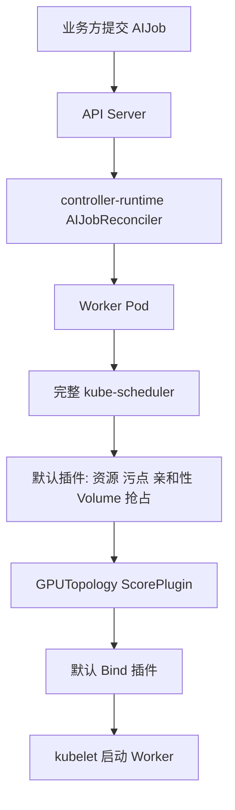
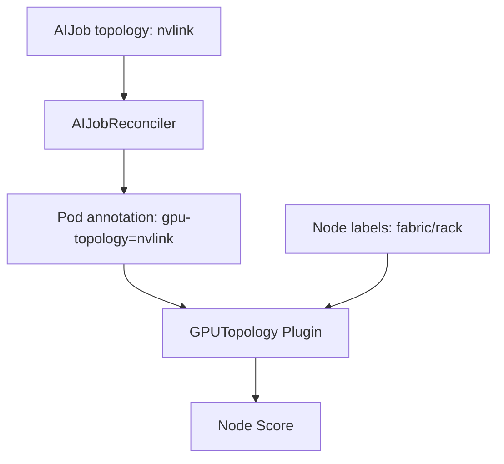
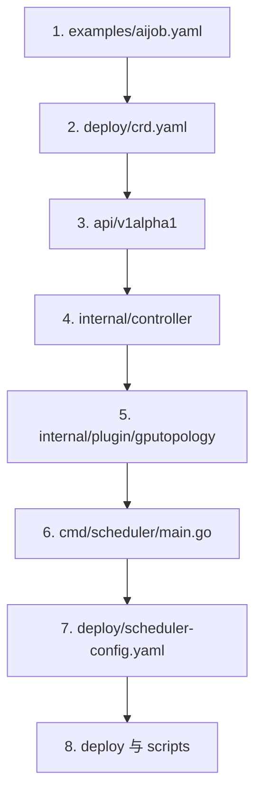

# 用 Controller Runtime 与 Scheduler Framework 扩展 Kubernetes

这个项目演示一条更接近生产的 AI Infra 开发路径：业务方声明 `AIJob`，Controller 将它翻译为 GPU Worker Pod，Scheduler Framework 插件在默认 kube-scheduler 的打分阶段加入 NVLink、PCIe 与机架亲和度。

我们不重写调度队列、资源过滤、抢占或 Bind。它们由 kube-scheduler 负责；项目只实现 AI 场景独有的扩展点。

## 一、业务方如何使用

平台组件安装完成后，训练业务只提交 YAML：

```yaml
apiVersion: infra.example.io/v1alpha1
kind: AIJob
metadata:
  name: demo-training
spec:
  workers: 4
  gpuPerWorker: 2
  gpuResource: nvidia.com/gpu
  topology: nvlink
  image: registry.example.com/training:v1
```

字段表达的是业务意图：

- `workers`：分布式训练的 Worker 数量；
- `gpuPerWorker`：每个 Worker 请求的 GPU 数量；
- `gpuResource`：Device Plugin 上报的扩展资源名；
- `topology`：`nvlink`、`pcie` 或 `same-rack`；
- `image`：训练镜像。

业务方不创建 Pod，也不直接选择 Scheduler。Controller 统一生成 Worker Pod并写入：

```yaml
spec:
  schedulerName: ai-scheduler
  containers:
    - resources:
        limits:
          nvidia.com/gpu: 2
metadata:
  annotations:
    infra.example.io/gpu-topology: nvlink
```

## 二、系统分工



Controller 回答“AIJob 应该产生哪些 Pod”。Scheduler 插件回答“通过默认硬约束的 Node 中，哪个 GPU 拓扑更合适”。

### 为什么插件不直接读取 AIJob

Scheduler Framework 的核心输入是 Pod 和 Node，而不是任意 CRD。Controller 负责做一次 API 翻译：



这样 Scheduler 插件不依赖 AIJob Client，也不需要在每次节点打分时访问 API Server。

## 三、项目阅读顺序



1. `examples/aijob.yaml`：先看业务方声明什么。
2. `deploy/crd.yaml`：看 API Server 如何注册和校验 AIJob。
3. `api/v1alpha1`：看强类型 `AIJobSpec`、`AIJobStatus` 与 Scheme 注册。
4. `internal/controller/aijob_controller.go`：只关注 `Reconcile` 如何创建 Worker Pod。
5. `internal/plugin/gputopology/plugin.go`：看 `PreScorePlugin` 和 `ScorePlugin` 的实现。
6. `cmd/scheduler/main.go`：看插件如何注册到 kube-scheduler 二进制。
7. `deploy/scheduler-config.yaml`：看 scheduler profile 如何启用插件和配置权重。
8. `deploy/controller.yaml`、`deploy/rbac.yaml` 与 `scripts/label-nodes.sh`：最后看运行和权限。

## 四、Controller：只写 Reconcile

Controller 使用 `controller-runtime`。入口声明它管理 AIJob，并监听自己创建的 Pod：

```go
return ctrl.NewControllerManagedBy(manager).
    For(&aiv1alpha1.AIJob{}).
    Owns(&corev1.Pod{}).
    Complete(r)
```

`AIJobReconciler` 实现的是 controller-runtime 的接口：

```go
var _ reconcile.Reconciler = &AIJobReconciler{}

func (r *AIJobReconciler) Reconcile(
    ctx context.Context,
    request ctrl.Request,
) (ctrl.Result, error)
```

Reconcile 只表达业务逻辑：

1. 获取 AIJob；
2. 列出它拥有的 Worker Pod；
3. 创建缺少的 Worker，删除缩容后多余的 Worker；
4. 汇总并更新 status。

Informer、缓存、Workqueue、失败退避和 Worker goroutine 仍然存在，但由 controller-runtime 管理。理解它们有助于排障，不需要在入门项目中手写。

OwnerReference 由下面的调用设置：

```go
ctrl.SetControllerReference(job, pod, r.Scheme)
```

因此删除 AIJob 后，Kubernetes Garbage Collector 会回收 Worker Pod。

## 五、Scheduler：扩展默认调度器

### 1. 明确实现 Framework 接口

插件包含编译期接口断言：

```go
var _ framework.PreScorePlugin = &Plugin{}
var _ framework.ScorePlugin = &Plugin{}
```

Go 没有 `implements` 关键字，只要方法集合匹配就实现接口；上述断言会在签名不匹配时直接编译失败。

插件实现三个关键方法：

```go
func (p *Plugin) Name() string
func (p *Plugin) PreScore(...) *framework.Status
func (p *Plugin) Score(...) (int64, *framework.Status)
```

### 2. 为什么使用 PreScore

同一 Pod 会针对许多候选 Node 调用 `Score`。`PreScore` 每个调度周期只执行一次，适合计算可复用状态。

例如 `same-rack` 会先查找同一 AIJob 已运行 Worker 所在的机架，然后写入 `CycleState`：

```go
state.Write(stateKey, &cycleData{preferredRack: rack})
```

后续每次 `Score` 直接读取，不重复扫描集群快照。

### 3. Score 只改变偏好

插件当前使用以下简化分值：

| AIJob 偏好 | Node 标签 | 分数 |
| --- | --- | ---: |
| `nvlink` | `gpu-fabric=nvlink` | 100 |
| `nvlink` | `gpu-fabric=pcie` | 50 |
| `pcie` | `gpu-fabric=nvlink` | 100 |
| `pcie` | `gpu-fabric=pcie` | 80 |
| `same-rack` | 与已有 Worker 同 rack | 100 |
| 其他情况 | 无匹配 | 0 |

这是软偏好，所以实现 `ScorePlugin`。如果某项要求不满足就不能运行，例如必须具备 RDMA，应使用 `FilterPlugin` 返回 `Unschedulable`，或者让 Controller 生成标准 NodeAffinity。

### 4. 谁负责 GPU 容量

默认 `NodeResourcesFit` 插件会检查 Pod 的扩展资源请求：

```yaml
limits:
  nvidia.com/gpu: 2
```

因此本插件不重复统计 GPU。它也不处理 Taint、Volume、CPU、内存和抢占，这些继续由默认插件负责。

### 5. 谁选择具体 GPU

Scheduler 选择的是 Node，不是 Node 内的 GPU 编号。具体分配哪张 GPU 通常由 Device Plugin 或 DRA 完成。NVLink/PCIe 拓扑如果只以 Node Label 表达，插件只能选择机器或拓扑域；要精确选择设备，需要结合 DRA、CDI 或厂商设备管理能力。

## 六、注册插件

Scheduler Framework 插件需要编译进 kube-scheduler 二进制，不是运行时上传一个 `.so` 文件。

`cmd/scheduler/main.go` 复用官方 kube-scheduler，并注册一个 out-of-tree 插件工厂：

```go
command := app.NewSchedulerCommand(
    app.WithPlugin(gputopology.Name, gputopology.New),
)
```

`deploy/scheduler-config.yaml` 再通过 profile 启用插件：

```yaml
profiles:
  - schedulerName: ai-scheduler
    plugins:
      preScore:
        enabled:
          - name: GPUTopology
      score:
        enabled:
          - name: GPUTopology
            weight: 5
```

最终 Node 总分由默认插件分数和 `GPUTopology * 5` 共同决定。

实现某个 Go 接口不等于自动启用对应扩展点。这里必须同时在 `preScore` 和 `score` 中配置插件；否则 `PreScore` 不会写入 `CycleState`，后续 `Score` 就无法读取预计算结果。

这个实验额外运行一个名为 `ai-scheduler` 的完整 kube-scheduler，不修改 kind 自带的 `default-scheduler`。普通 Pod 不受影响，AIJob Worker 通过 `spec.schedulerName: ai-scheduler` 进入该 profile。

因为运行的是完整 kube-scheduler，ServiceAccount 需要的不只是 Pod 和 Node 权限。`deploy/rbac.yaml` 同时绑定：

- `system:kube-scheduler`：Pod、Node、Binding、Event 等核心调度权限；
- `system:volume-scheduler`：StorageClass、PV 和 PVC 调度权限；
- `extension-apiserver-authentication-reader`：读取 API Server 请求头认证配置。

缺少 `system:volume-scheduler` 时，即使 AIJob 不使用 PVC，默认 VolumeBinding 插件的 informer 也无法完成缓存同步，整个调度器不会开始处理 Pod。这正是复用默认调度器时需要接受的完整组件契约。

## 七、安装和运行

需要 Go 1.22+、Docker、kubectl、kind、make 和 Bash，不需要 Kubebuilder、Operator SDK 或真实 GPU。

```bash
make test
make cluster
make deploy
make demo
```

kind 没有 GPU Device Plugin。`scripts/label-nodes.sh` 会进行两种模拟：

1. 给 Node 添加 `gpu-fabric` 和 `rack` 标签；
2. 在 Node status 中加入 `example.com/gpu: 4` 扩展资源。

示例 AIJob 因此使用：

```yaml
gpuResource: example.com/gpu
```

生产环境应改为 Device Plugin 实际上报的 `nvidia.com/gpu` 等资源。

观察结果：

```bash
kubectl get aijob
kubectl get pods -o wide
kubectl get nodes -L infra.example.io/gpu-fabric,infra.example.io/rack
kubectl -n ai-infra-system logs deployment/aijob-controller
kubectl -n ai-infra-system logs deployment/ai-scheduler
```

删除实验环境：

```bash
make clean
```

## 八、扩展点怎么选

| 需求 | 扩展点 |
| --- | --- |
| 预计算作业已有 Worker 的拓扑 | `PreScore` |
| 偏好 NVLink、同机架或模型缓存命中 | `Score` |
| 必须有 RDMA、特定 GPU 型号或显存规格 | `Filter` |
| 整组 Worker 同时放行 | `Reserve` + `Permit` |
| 失败时释放 Gang 预留 | `Unreserve` |
| 自定义队列公平性 | `QueueSort`，但每个 profile 只能有一个 |
| 绑定前准备网络或设备 | `PreBind` |

本项目先只实现 `PreScore + Score`，因为“默认调度器已经能运行 Pod，但不理解 AI 拓扑偏好”正是最小且合理的扩展边界。

## 九、版本与生产边界

Scheduler Framework 插件与 Kubernetes 内部包紧密耦合。本项目将 Kubernetes、`client-go`、controller-runtime 和 kind 节点锁定到 1.30 对应版本，并在 `go.mod` 显式对齐 staging modules。升级集群时应同步升级插件并重新编译测试。

生产化还应补充：

- 用 Kubebuilder/controller-gen 生成 DeepCopy、CRD 和 RBAC；
- Controller 与 Scheduler Leader Election；
- Node Feature Discovery 或厂商组件自动维护拓扑标签；
- Scheduler 插件配置类型、指标、Event 和调度性能测试；
- 对缺失/过期拓扑信息定义降级策略；
- Gang Scheduling 的 Reserve、Permit 和 Unreserve；
- 基于 DRA 的设备级拓扑分配。

本项目的重点不再是复刻 Kubernetes 控制循环，而是展示两个稳定扩展面：用 Controller Runtime 扩展声明式 API，用 Scheduler Framework 扩展默认调度决策。
