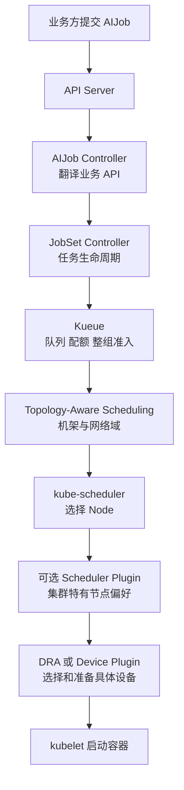
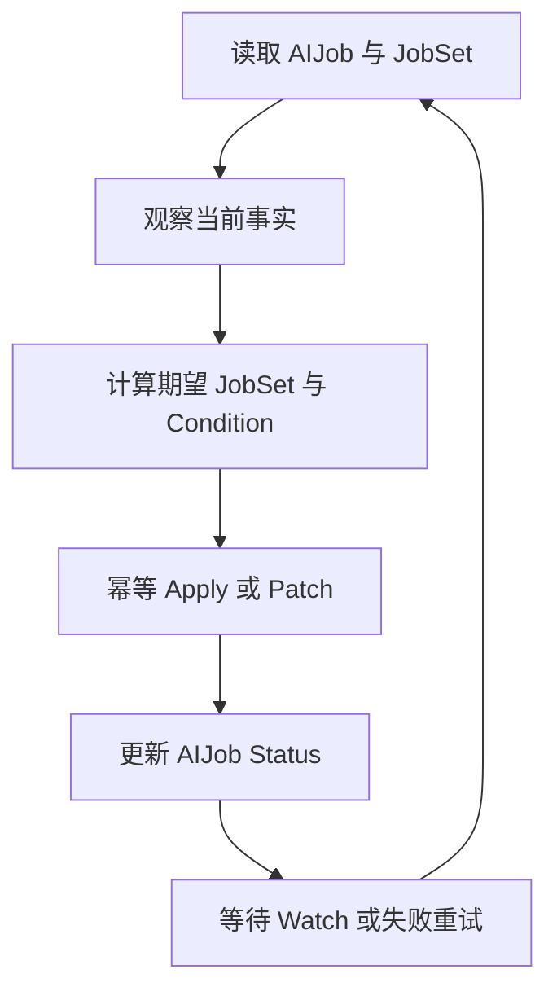
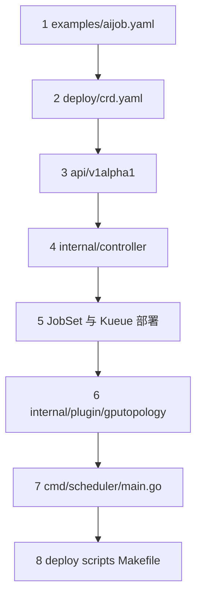
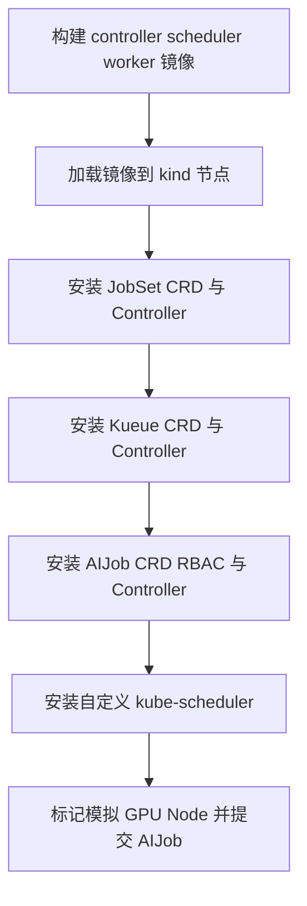

# 用 Kubernetes 标准组件扩展 AI 训练任务

这个项目演示生产中更常见的 AI Infra 分层：业务方声明 `AIJob`，一个很薄的 Controller 将它翻译为 `JobSet`；JobSet 管理分布式任务生命周期，Kueue 负责整组准入、配额和跨节点拓扑，kube-scheduler 与设备驱动完成节点和 GPU 分配。

项目仍保留一个 Scheduler Framework 插件，用来展示标准调度器无法表达的集群级节点偏好。它不是 Job Controller，也不能替代设备驱动。

## 一、业务方如何使用

平台组件安装完成后，训练业务只提交声明式 YAML：

```yaml
apiVersion: infra.example.io/v1alpha1
kind: AIJob
metadata:
  name: demo-training
  labels:
    kueue.x-k8s.io/queue-name: training
spec:
  workers: 4
  gpuPerWorker: 2
  gpuResource: nvidia.com/gpu
  topology: nvlink
  image: registry.example.com/training:v1
```

字段表达业务意图：

- `workers`：分布式训练的 Worker 数量；
- `gpuPerWorker`：每个 Worker 请求的 GPU 数量；
- `gpuResource`：Device Plugin 或 DRA 暴露的资源名；
- `topology`：实验中的 `nvlink`、`pcie` 或 `same-rack`；
- `image`：训练镜像；
- `kueue.x-k8s.io/queue-name`：任务进入的 LocalQueue。

业务方不创建 Pod，不指定某个 Node，也不负责在代码中调用 Controller 或 Scheduler。各组件通过 Kubernetes API 中的资源协作。

## 二、生产架构的职责边界



### AIJob Controller

Controller 只负责 AI 领域 API 的适配：

1. 读取 `AIJob.spec`；
2. 生成或更新一个由它拥有的 `JobSet`；
3. 把 JobSet 的 Conditions 投影到 `AIJob.status`。

它不再逐个创建、删除和统计 Worker Pod。

### JobSet

JobSet 复用 Kubernetes Job，负责通用的分布式任务能力：

- 创建和管理一组 Indexed Job；
- 稳定的 Worker DNS；
- 完成、失败和整组重启策略；
- suspend/resume；
- leader/worker 等多模板任务。

### Kueue

Kueue 是 Job 级管理器，不替代 kube-scheduler。它在任务开始创建 Pod 之前决定：

- 队列是否有配额；
- 所有 Worker 是否能作为一组获得资源；
- 使用哪个 ResourceFlavor；
- Worker 应位于哪个 rack、block 或其他拓扑域。

AIJob 通过 JobSet 使用 Kueue 已有集成，不需要重新实现 Kueue 的 `GenericJob` 接口。

### kube-scheduler 和设备层

kube-scheduler 在可行 Node 中选择一个 Node。Scheduler Framework 插件可以补充公司特有的节点过滤或打分，但默认插件继续负责 CPU、内存、扩展资源、污点、Volume 和抢占。

选择 Node 内的具体 GPU 不属于普通 `ScorePlugin` 的职责。它应由以下组件负责：

- 传统集群：GPU Device Plugin 与 kubelet Topology Manager；
- 新集群：DRA Driver、`DeviceClass`、`ResourceClaim` 和 `ResourceSlice`；
- NVIDIA Multi-Node NVLink：支持 ComputeDomain 的 NVIDIA DRA Driver。

## 三、状态机与 Reconcile 的关系

Controller-runtime 已经通用化了 Informer、缓存、Workqueue、失败退避、并发 Worker 和 Leader Election。业务代码不应该再次实现这些设施。

但 Reconcile 接收的不是严格有序、仅消费一次的领域事件。通知可能重复、合并或延迟，Controller 也可能在任意一步崩溃，因此 API Server 中的资源才是事实来源。

工程上通常把一次 Reconcile 拆成下面的阶段：



程序员维护的是 `观察结果 -> 下一动作和状态` 的业务规则；Controller-runtime 维护执行机制。复杂任务可以显式定义状态和转移函数，但每次处理仍需幂等，并能从 Kubernetes 资源重建状态。

本项目的状态以标准 Condition 表达，而不是只维护一个容易过期的枚举：

```yaml
status:
  observedGeneration: 3
  conditions:
    - type: Ready
      status: "False"
      reason: WaitingForAdmission
      observedGeneration: 3
```

`observedGeneration` 用来区分 Condition 描述的是当前 spec，还是用户修改前的旧 spec。

## 四、拓扑需求应定义在哪里

“拓扑”至少包含三个层次，不能只用一个 Node Label 解决。

| 层次 | 示例 | 负责组件 |
| --- | --- | --- |
| 跨节点放置 | 同 rack、同 leaf switch、同 NVLink domain | Kueue TAS |
| Node 选择 | GPU 型号、缓存命中、公司特有评分 | kube-scheduler 默认插件或自定义插件 |
| Node 内设备 | 同 NUMA、同 PCIe root、GPU 间 NVLink | DRA/Device Plugin/Topology Manager |

### 跨节点拓扑

Kueue TAS 面向整个 PodSet 做资源准入，而不是等第一个 Worker 调度后再让其他 Worker 跟随。生产中可以把 AIJob 的严格性翻译为 JobSet PodTemplate 上的注解：

```yaml
metadata:
  annotations:
    kueue.x-k8s.io/podset-required-topology: topology.kubernetes.io/rack
```

如果只是偏好同一拓扑域，则使用 `podset-preferred-topology`。具体键由集群管理员在 Kueue `Topology` 中定义。

### Node 内 GPU 拓扑

普通 Scheduler Plugin 只给 Node 打分，无法保证容器最终拿到哪几张 GPU。要表达“多张 GPU 共享 PCIe root”或“设备之间存在 NVLink”，设备驱动需要把这些属性发布为 DRA 设备属性，再由 `ResourceClaim` 的 selector/constraint 请求合适的设备组合。

本实验没有真实 GPU，所以只能用 Node Label 模拟节点级 `nvlink` 和 `pcie` 偏好。这是教学替身，不是生产设备分配方案。

## 五、项目阅读顺序

建议按业务声明到基础设施的方向阅读：



1. `examples/aijob.yaml`：业务方声明的训练需求。
2. `deploy/crd.yaml`：API Server 如何注册和校验 AIJob。
3. `api/v1alpha1`：`AIJobSpec`、Conditions 和 Scheme 注册。
4. `internal/controller/aijob_controller.go`：AIJob 如何被翻译成 JobSet。
5. JobSet/Kueue manifest：通用任务生命周期、队列与拓扑如何接管。
6. `internal/plugin/gputopology/plugin.go`：仍需自定义时，如何实现节点打分扩展点。
7. `cmd/scheduler/main.go` 与 `deploy/scheduler-config.yaml`：插件如何注册和启用。
8. `deploy/`、`scripts/` 与 `Makefile`：最后看安装、权限和本地实验。

## 六、AIJob Controller 的目标形态

入口声明它管理 AIJob，并监听自己创建的 JobSet：

```go
return ctrl.NewControllerManagedBy(manager).
    For(&aiv1alpha1.AIJob{}).
    Owns(&jobsetv1alpha2.JobSet{}).
    Complete(r)
```

Go 通过方法集合隐式实现接口，可以用编译期断言明确契约：

```go
var _ reconcile.Reconciler = &AIJobReconciler{}
```

Reconcile 的主路径保持在同一抽象层：

```go
func (r *AIJobReconciler) Reconcile(ctx context.Context, req ctrl.Request) (ctrl.Result, error) {
    job, err := r.loadAIJob(ctx, req.NamespacedName)
    if err != nil {
        return ctrl.Result{}, client.IgnoreNotFound(err)
    }

    desired := desiredJobSet(job)
    if err := r.applyJobSet(ctx, job, desired); err != nil {
        return ctrl.Result{}, err
    }
    return ctrl.Result{}, r.reconcileStatus(ctx, job, desired)
}
```

辅助函数分别负责读取、构造、写入和状态归约，避免一个函数同时处理所有细节。所有写入都必须允许重复执行。

OwnerReference 仍由下面的调用设置：

```go
ctrl.SetControllerReference(aiJob, jobSet, r.Scheme)
```

删除 AIJob 后，Kubernetes Garbage Collector 会回收 JobSet；JobSet Controller 再清理其拥有的 Job 和 Pod。

## 七、Scheduler Plugin 的合理边界

插件通过编译期断言实现 Framework 接口：

```go
var _ framework.ScorePlugin = &Plugin{}
```

它只对已经通过默认硬约束的 Node 增加分数：

| AIJob 偏好 | Node 标签 | 分数 |
| --- | --- | ---: |
| `nvlink` | `gpu-fabric=nvlink` | 100 |
| `nvlink` | `gpu-fabric=pcie` | 50 |
| `pcie` | `gpu-fabric=nvlink` | 100 |
| `pcie` | `gpu-fabric=pcie` | 80 |
| 其他情况 | 无匹配 | 0 |

默认 `NodeResourcesFit` 会检查 Pod 的扩展资源请求，因此插件不重复统计 GPU。它也不处理 Taint、Volume、CPU、内存和抢占。

`same-rack` 不再通过“查找已经运行的第一个 Worker”实现。这个做法不能保证整组资源可用，会产生部分 Worker 已运行、其余 Worker 无处可放的情况。整组机架约束交给 Kueue TAS。

### 注册插件

Scheduler Framework 插件需要编译进 kube-scheduler 二进制：

```go
command := app.NewSchedulerCommand(
    app.WithPlugin(gputopology.Name, gputopology.New),
)
```

Scheduler profile 再启用对应扩展点：

```yaml
profiles:
  - schedulerName: ai-scheduler
    plugins:
      preScore:
        enabled:
          - name: GPUTopology
      score:
        enabled:
          - name: GPUTopology
            weight: 5
```

这个实验额外运行一个 `ai-scheduler`，不替换 kind 自带的 `default-scheduler`。JobSet 创建的 Worker Pod 通过 PodTemplate 中的 `schedulerName` 使用它。

## 八、安装和运行

本地实验固定使用 Kubernetes 1.34.8、Go 1.24、JobSet 0.10.1 和 Kueue 0.14.3，还需要 Docker、kubectl、kind、make 和 Bash，不需要真实 GPU。Go 依赖使用 Kubernetes 1.34.1，和集群保持相同 minor；`make deploy` 会安装固定版本的 JobSet 和 Kueue。

先确认本地工具可用：

```bash
docker version
kubectl version --client
kind version
go version
```

项目的运行顺序如下。建议为实验集群指定独立名称，避免覆盖本机已有的 kind 集群：

```bash
make test
make cluster CLUSTER=ai-infra-lab-v134
kubectl config current-context
make deploy CLUSTER=ai-infra-lab-v134
make demo
```

`make cluster` 会把当前 kubectl context 切换到新集群。`make deploy` 中的 kubectl 命令使用当前 context，因此部署前应确认输出是 `kind-ai-infra-lab-v134`。`CLUSTER` 参数同时告诉 kind 应把本地业务镜像加载到哪个集群。

部署顺序是：



### 镜像源

构建阶段包含两个来源：

- `golang:1.24.0` 来自 Docker Hub，可以使用 Docker daemon 的 `registry-mirrors` 加速；
- distroless 原始镜像位于 `gcr.io`，Docker Hub mirror 不会代理它。

本项目默认通过 `m.daocloud.io` 获取 distroless。该地址是用于本地实验的第三方代理；生产构建应使用组织自己的可信镜像仓库，并按 digest 固定基础镜像。切回官方地址：

```bash
make image RUNTIME_IMAGE=gcr.io/distroless/static-debian12:nonroot
```

`make deploy` 还会从 GitHub Release 安装 JobSet 和 Kueue 清单，这部分也不经过 Docker Hub mirror。

kind 没有 GPU Device Plugin。`scripts/label-nodes.sh` 会：

1. 给 Node 添加模拟的 fabric 和 rack 标签；
2. 在 Node status 中加入 `example.com/gpu` 扩展资源。

示例因此使用 `example.com/gpu`。生产环境应安装 GPU Operator、Device Plugin 或 DRA Driver，并改用真实资源与设备属性。

观察结果：

```bash
kubectl get aijob
kubectl get jobsets
kubectl get workloads.kueue.x-k8s.io
kubectl get jobs,pods -o wide
kubectl -n ai-infra-system logs deployment/aijob-controller
kubectl -n ai-infra-system logs deployment/ai-scheduler
```

一个正常运行的示例会经历 `AIJob -> JobSet -> Workload -> Job -> Pod`。可用下面的命令沿资源所有权逐层检查，而不是只看最终 Pod：

```bash
kubectl get aijob demo-training -o yaml
kubectl get jobset demo-training -o yaml
kubectl get workloads.kueue.x-k8s.io
kubectl get jobs,pods -l infra.example.io/aijob=demo-training -o wide
```

### 常见问题

如果 kind 节点日志出现 `Failed to create control group inotify object: Too many open files`，检查 WSL 的 inotify instance 上限：

```bash
sysctl fs.inotify.max_user_instances
sudo sysctl -w fs.inotify.max_user_instances=1024
```

这是宿主机 inotify instance 耗尽，不是节点镜像损坏。第二条只修改当前运行时；需要永久保留时，应通过 WSL 的系统配置管理，而不是写入项目脚本。

如果基础镜像报 DNS 或超时错误，先根据错误中的 registry 判断来源。`docker.io` 可以检查 daemon mirror，`gcr.io` 则应检查 `RUNTIME_IMAGE` 是否使用可访问的显式代理地址。

删除实验环境：

```bash
make clean CLUSTER=ai-infra-lab-v134
```

## 九、什么时候才写自定义扩展

优先复用已有能力：

| 需求 | 首选组件 |
| --- | --- |
| Worker 生命周期、重试、稳定 DNS | JobSet / Kubernetes Job |
| 队列、配额、公平性、抢占 | Kueue |
| 同 rack、同 block、整组准入 | Kueue TAS |
| CPU、内存、GPU 数量、污点、Volume | kube-scheduler 默认插件 |
| NUMA 对齐 | kubelet Topology Manager |
| 具体 GPU、MIG、PCIe/NVLink 设备关系 | DRA 或厂商 Device Plugin |
| 公司特有且标准 API 无法表达的 Node 偏好 | Scheduler Framework Plugin |

扩展 Kubernetes 的核心不是尽可能多写 Controller 和 Scheduler，而是在正确的层只补齐标准组件没有表达的领域语义。

## 十、进一步阅读

- [Kubernetes Controller](https://kubernetes.io/docs/concepts/architecture/controller/)
- [JobSet](https://jobset.sigs.k8s.io/docs/overview/)
- [Kueue 自定义 Job 集成](https://kueue.sigs.k8s.io/docs/tasks/dev/integrate_a_custom_job/)
- [Kueue Topology-Aware Scheduling](https://kueue.sigs.k8s.io/docs/concepts/topology_aware_scheduling/)
- [Kubernetes Scheduling Framework](https://kubernetes.io/docs/concepts/scheduling-eviction/scheduling-framework/)
- [Kubernetes Dynamic Resource Allocation](https://kubernetes.io/docs/concepts/scheduling-eviction/dynamic-resource-allocation/)
- [NVIDIA DRA Driver](https://docs.nvidia.com/datacenter/cloud-native/gpu-operator/latest/dra-intro-install.html)
